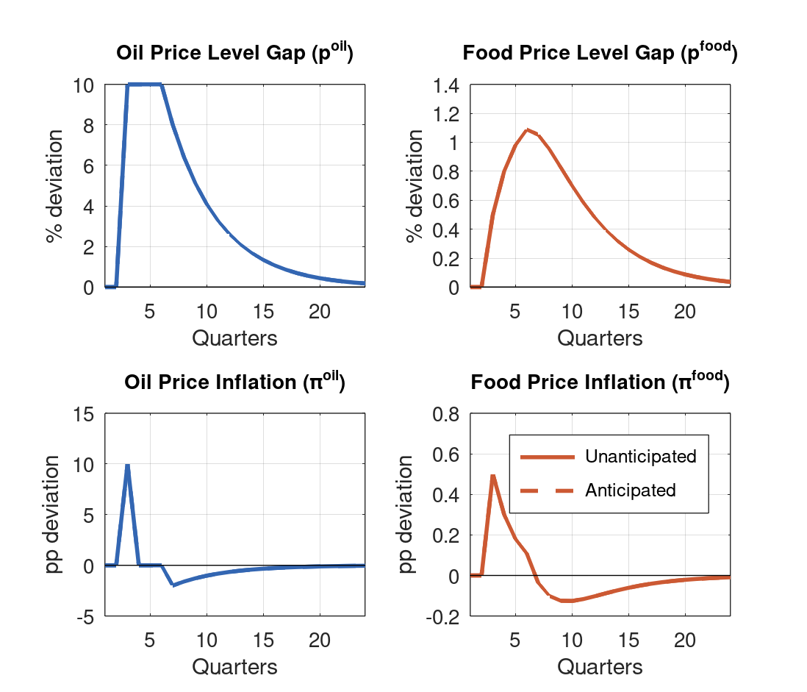
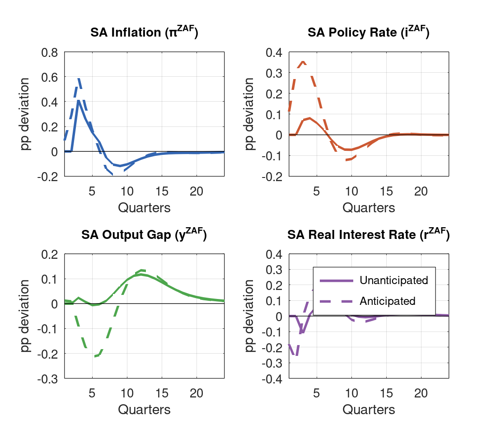
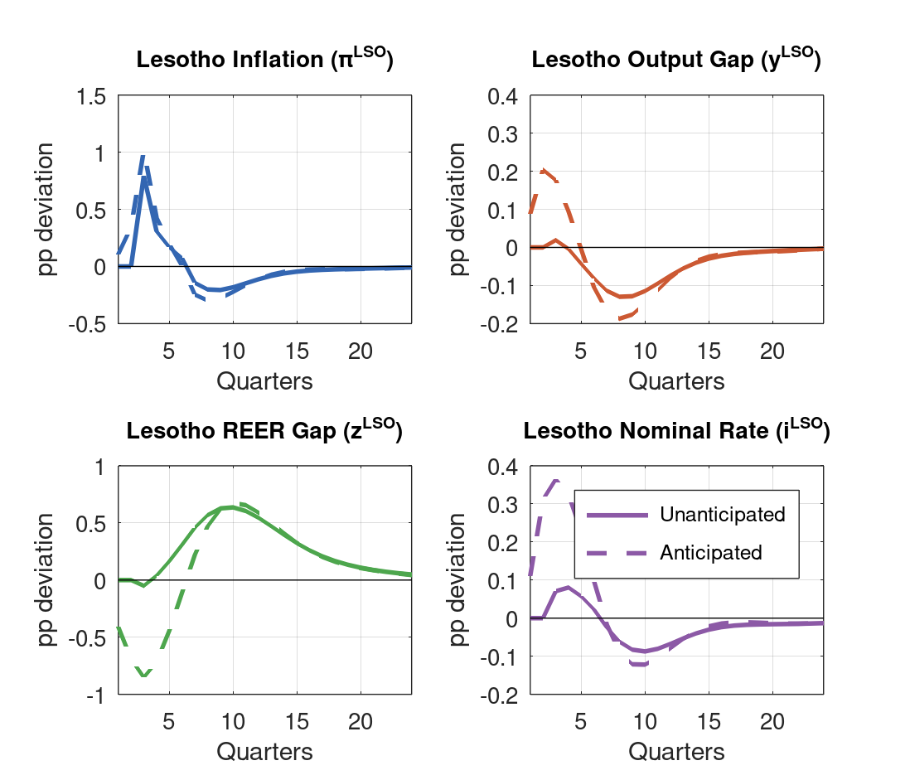
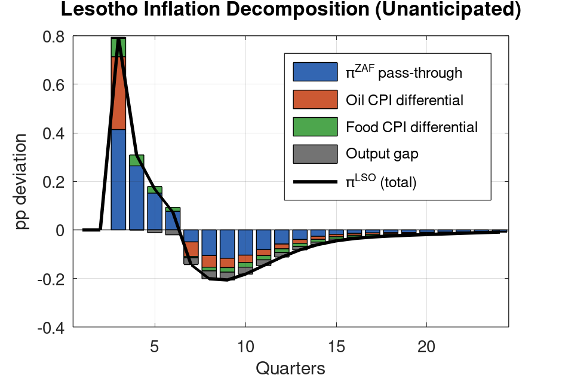
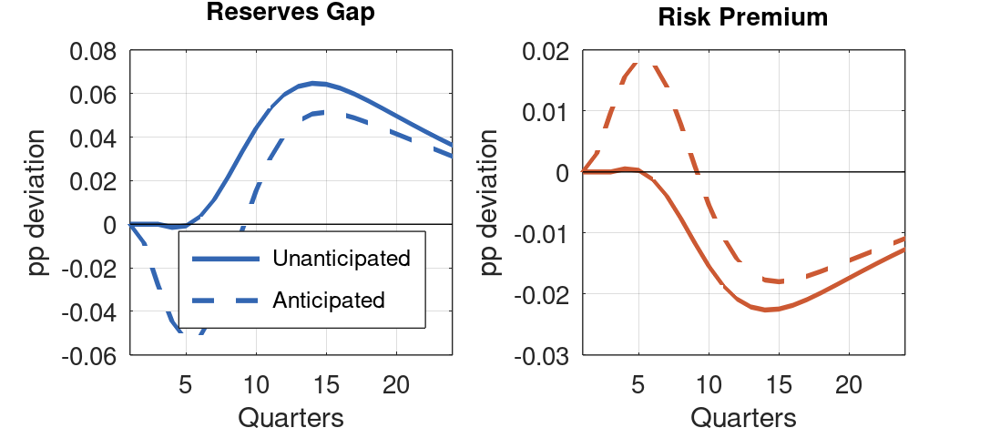

::: {.callout-note appearance="minimal"}
**Model:** Lesotho QPM V4 (28 equations, level-based oil/food AR(1), enriched oil/food transmission). **Shock:** Sustained 10% oil price increase for 4 quarters (Q3--Q6), then natural decay. **Regimes:** Unanticipated (stoch\_simul with superposition) vs. anticipated (perfect foresight). **Solver:** Dynare 6.5, first-order perturbation / deterministic simulation.
:::

## Executive Summary {.unnumbered}

This report analyses a **delayed sustained oil price shock** — a 10% increase in global oil prices lasting four quarters but beginning only in Q3 rather than Q1. The two-quarter delay creates a natural experiment for studying anticipation effects: under perfect foresight, agents adjust behavior before the shock materialises. Key findings:

- **Pre-shock anticipation effects (Q1--Q2):** Under the anticipated regime, SA inflation rises (+0.09pp in Q1, +0.29pp in Q2) and the Lesotho real rate falls sharply (-0.23pp in Q1, -0.70pp in Q2) before oil prices move. This occurs because forward-looking agents price in future inflation, triggering preemptive SARB tightening and Lesotho output expansion (+0.09pp in Q1, +0.20pp in Q2).

- **Peak inflation diverges across regimes:** Lesotho inflation peaks at +1.02pp (anticipated, Q3) versus +0.79pp (unanticipated, Q3). Anticipation concentrates the inflationary impulse as the SA forward-looking Phillips curve prices in the full shock path.

- **Real rate sign reversal:** The defining difference between regimes. In the anticipated case, the Lesotho real rate falls throughout Q1--Q5 (trough -0.70pp, Q2), making the shock expansionary. In the unanticipated case, the real rate rises from Q4 (peak +0.17pp, Q7), making the shock contractionary.

- **Output dynamics are opposite:** Lesotho output expands under anticipation (peak +0.20pp, Q2) but contracts under surprise (trough -0.13pp, Q8). The mechanism is the Fisher equation: anticipated inflation raises $E[\pi_{t+1}]$, lowering the real rate; unanticipated level-based inflation is transient, so $E[\pi_{t+1}]$ collapses and the real rate rises.

- **Slower oil price decay with $\rho_{oil} = 0.80$:** Oil prices now revert more slowly after Q6 ($+8.0\% \to +6.4\% \to +5.1\%$), producing more persistent inflation effects, larger cumulative output losses, and a longer adjustment path compared to the previous calibration ($\rho_{oil} = 0.70$).

- **Convergence:** Both regimes converge to similar paths by Q16--Q20, with reserve gaps and premia fading. The long-run is regime-independent; differences are concentrated in the first 10 quarters.

## Shock Design

### Rationale

Delayed oil price shocks are relevant for scenarios where supply disruptions are anticipated — such as OPEC production cuts with announced implementation dates, seasonal demand patterns, or geopolitical tensions with lead times. The two-quarter delay tests whether Lesotho's monetary framework (pegged to the SARB) transmits anticipation effects or only responds contemporaneously.

### Specification

The oil price level gap follows an AR(1) process:

$$p^{oil}_t = 0.80 \cdot p^{oil}_{t-1} + \varepsilon^{oil}_t$$

Oil price inflation is the first difference: $\pi^{oil}_t = p^{oil}_t - p^{oil}_{t-1}$.

To sustain $p^{oil} = +10\%$ for Q3--Q6 with $\rho_{oil} = 0.80$:

| Quarter | Q1 | Q2 | Q3 | Q4 | Q5 | Q6 | Q7+ |
|:--------|:--:|:--:|:--:|:--:|:--:|:--:|:---:|
| $\varepsilon^{oil}$ | 0 | 0 | 0.10 | 0.02 | 0.02 | 0.02 | 0 |
| $p^{oil}$ (%) | 0 | 0 | +10.0 | +10.0 | +10.0 | +10.0 | +8.0 |
| $\pi^{oil}$ (pp) | 0 | 0 | +10.0 | 0 | 0 | 0 | -2.0 |

After Q6, the oil price decays naturally: $+8.0\% \to +6.4\% \to +5.1\% \to \ldots$ The higher persistence ($\rho_{oil} = 0.80$ vs 0.70) means slower mean reversion, with a half-life of approximately 3.1 quarters compared to 1.9 quarters previously.

### Food Price Spillover

Oil prices feed into food prices via the energy-input channel ($\kappa_{oil \to food} = 0.05$):

$$p^{food}_t = 0.60 \cdot p^{food}_{t-1} + 0.05 \cdot p^{oil}_t + \varepsilon^{food}_t$$

The food price gap accumulates during Q3--Q6 as the elevated oil price level compounds through the AR(1). The higher oil persistence amplifies the food channel as the elevated oil level feeds into food prices for longer.

{width=90%}

## Transmission Channels

### Oil → SA Inflation (Direct Channel)

Oil price inflation enters the SA hybrid Phillips curve via $\lambda_4 = 0.03$:

$$\pi^{ZAF}_t = 0.50 \cdot \pi^{ZAF}_{t-1} + 0.50 \cdot E_t[\pi^{ZAF}_{t+1}] + 0.30 \cdot \hat{y}^{ZAF}_t + 0.15 \cdot \Delta z^{ZAF}_t + 0.03 \cdot \pi^{oil}_t + 0.05 \cdot \pi^{food}_t$$

With the level-based specification, $\pi^{oil}$ spikes in Q3 (when $p^{oil}$ jumps from 0 to 10%) then returns to zero for Q4--Q6 (price level is constant at 10%). This produces a single-quarter direct impulse. Under anticipated shocks, the forward-looking component ($0.50 \cdot E_t[\pi^{ZAF}_{t+1}]$) prices this in during Q1--Q2.

### Oil → Food Prices (Indirect Channel)

The $\kappa_{oil \to food} = 0.05$ parameter generates a secondary inflationary impulse through food prices. Unlike the direct oil channel, this accumulates gradually because food price inflation reflects the *change* in a slowly-building food price level. The higher oil persistence ($\rho_{oil} = 0.80$) means the food channel remains active for longer after Q6.

### SA Inflation → Lesotho (Peg Transmission)

Lesotho inflation tracks SA one-for-one, plus CPI-weight differentials:

$$\pi^{LSO}_t = \pi^{ZAF}_t + 0.03 \cdot \pi^{oil}_t + 0.15 \cdot \pi^{food}_t + 0.25 \cdot \hat{y}^{LSO}_t$$

The oil CPI differential (8% vs 5%) and food CPI differential (35% vs 20%) amplify the shock for Lesotho relative to SA. Peak Lesotho inflation exceeds SA inflation by roughly 2x.

### SARB Monetary Policy Spillover

The SARB Taylor rule responds to expected inflation and the output gap:

$$i^{ZAF}_t = 0.75 \cdot i^{ZAF}_{t-1} + 0.25 \cdot (1.50 \cdot E_t[\pi^{ZAF}_{t+1}] + 0.50 \cdot \hat{y}^{ZAF}_t)$$

Under the peg, $i^{LSO} = i^{ZAF} + prem$. The Lesotho real rate $r^{LSO} = i^{LSO} - E[\pi^{LSO}_{t+1}]$ depends critically on whether agents anticipate the shock:

- **Anticipated:** $E[\pi^{LSO}_{t+1}]$ rises *before* the shock hits (Q1--Q2), lowering $r^{LSO}$ → expansionary
- **Unanticipated:** The inflation spike is a surprise and transient (level-based), so $E[\pi^{LSO}_{t+1}]$ collapses after Q3 → $r^{LSO}$ rises → contractionary

## Simulation Results: South Africa

### Impulse Response Comparison

| Quarter | $\pi^{ZAF}$ (U) | $\pi^{ZAF}$ (A) | $i^{ZAF}$ (U) | $i^{ZAF}$ (A) | $\hat{y}^{ZAF}$ (U) | $\hat{y}^{ZAF}$ (A) | $r^{ZAF}$ (U) | $r^{ZAF}$ (A) |
|:-------:|:---:|:---:|:---:|:---:|:---:|:---:|:---:|:---:|
| Q1 | 0.00 | +0.09 | 0.00 | +0.01 | 0.00 | +0.01 | 0.00 | -0.07 |
| Q2 | 0.00 | +0.29 | 0.00 | +0.01 | 0.00 | +0.01 | 0.00 | -0.28 |
| Q3 | +0.41 | +0.60 | +0.02 | -0.09 | +0.02 | -0.09 | +0.24 | +0.42 |
| Q4 | +0.26 | +0.36 | +0.01 | -0.17 | +0.01 | -0.17 | +0.22 | +0.35 |
| Q5 | +0.15 | +0.17 | -0.01 | -0.21 | -0.01 | -0.21 | +0.14 | +0.18 |
| Q6 | +0.08 | +0.01 | -0.00 | -0.21 | -0.00 | -0.21 | +0.07 | +0.06 |
| Q8 | -0.11 | -0.19 | +0.04 | -0.07 | +0.04 | -0.07 | -0.08 | -0.18 |
| Q12 | -0.06 | -0.06 | +0.12 | +0.13 | +0.12 | +0.13 | -0.08 | -0.08 |
| Q16 | -0.01 | -0.01 | +0.07 | +0.08 | +0.07 | +0.08 | -0.02 | -0.01 |

**U** = Unanticipated. **A** = Anticipated. All values in percentage points deviation from steady state.

Under the anticipated regime, SA inflation begins rising two quarters before the shock arrives. The forward-looking Phillips curve component ($0.50 \cdot E[\pi^{ZAF}_{t+1}]$) transmits the future oil price increase backward in time. The SARB begins tightening preemptively, but because the Taylor rule has strong inertia ($\phi_i = 0.75$), the policy rate adjustment is gradual. This means the SA real rate falls sharply in Q1--Q2 before the shock, briefly making monetary conditions expansionary.

The higher oil persistence ($\rho_{oil} = 0.80$) produces slightly larger and more sustained SA inflation responses compared to the previous calibration, as the post-Q6 decay is slower, keeping the food price channel active for longer.

{width=90%}

## Simulation Results: Lesotho

### Impulse Response Comparison

| Quarter | $\pi^{LSO}$ (U) | $\pi^{LSO}$ (A) | $\hat{y}^{LSO}$ (U) | $\hat{y}^{LSO}$ (A) | $r^{LSO}$ (U) | $r^{LSO}$ (A) | $z^{LSO}$ (U) | $z^{LSO}$ (A) |
|:-------:|:---:|:---:|:---:|:---:|:---:|:---:|:---:|:---:|
| Q1 | 0.00 | +0.11 | 0.00 | +0.09 | 0.00 | -0.23 | 0.00 | -0.41 |
| Q2 | 0.00 | +0.34 | 0.00 | +0.20 | 0.00 | -0.70 | 0.00 | -0.69 |
| Q3 | +0.79 | +1.02 | +0.02 | +0.18 | -0.08 | -0.06 | -0.05 | -0.85 |
| Q4 | +0.31 | +0.43 | -0.00 | +0.09 | +0.07 | +0.13 | +0.04 | -0.72 |
| Q5 | +0.17 | +0.20 | -0.04 | -0.01 | +0.14 | +0.23 | +0.17 | -0.44 |
| Q6 | +0.07 | +0.00 | -0.08 | -0.11 | +0.17 | +0.34 | +0.31 | -0.11 |
| Q8 | -0.20 | -0.30 | -0.13 | -0.19 | +0.14 | +0.19 | +0.57 | +0.47 |
| Q12 | -0.11 | -0.11 | -0.07 | -0.08 | +0.02 | -0.01 | +0.55 | +0.59 |
| Q16 | -0.04 | -0.03 | -0.02 | -0.02 | +0.01 | +0.01 | +0.26 | +0.26 |
| Q20 | -0.02 | -0.02 | -0.01 | -0.01 | +0.00 | +0.01 | +0.11 | +0.11 |

{width=90%}

### Inflation Dynamics

Lesotho inflation peaks at **+1.02pp** under anticipation versus **+0.79pp** under surprise, both in Q3 when the shock arrives. The difference arises because:

1. **Forward-looking SA Phillips curve:** Under anticipation, SA inflation is already elevated in Q1--Q2. When the oil shock hits in Q3, it compounds with the pre-existing inflationary pressure.
2. **CPI weight differentials:** Lesotho's higher oil (8% vs 5%) and food (35% vs 20%) CPI weights amplify the direct oil price inflation spike by +0.30pp and the food channel by +0.15pp, adding to the SA pass-through.
3. **Output gap contribution:** Under anticipation, the expansionary real rate effect raises Lesotho's output gap in Q1--Q3, adding demand-side inflation ($\beta_1 = 0.25$). Under surprise, the output gap is near zero at impact, providing no additional inflationary impulse.

After Q6, inflation turns negative under both regimes as oil prices decay (the level-based specification produces deflationary reversion). With $\rho_{oil} = 0.80$, the decay is slower ($-2.0$pp per quarter vs $-3.0$pp previously), producing a more gradual but more persistent deflationary undershoot. The anticipated regime shows slightly deeper undershooting (-0.30pp vs -0.20pp at Q8) reflecting the larger buildup of inflationary pressure that must be unwound.

{width=90%}

### Output Gap

The output response illustrates the core anticipated/unanticipated distinction:

- **Anticipated:** Output *expands* in Q1--Q3 (peak +0.20pp, Q2) as the falling real rate stimulates demand. The expansion occurs before the shock arrives — agents respond to the expected future inflation reducing current real borrowing costs.
- **Unanticipated:** Output is near zero at impact (+0.02pp, Q3), then contracts as the transient inflation spike raises the real rate. The trough is -0.13pp at Q8.

Both regimes converge to mild contraction by Q8--Q12 as the SARB tightening cycle works through the peg. The higher oil persistence extends the contractionary phase, with output still -0.02pp below steady state at Q16.

### Real Exchange Rate (REER)

The REER dynamics show the starkest anticipation effect:

- **Anticipated:** REER appreciates in Q1--Q2 (-0.41pp, -0.69pp) as agents expect higher Lesotho inflation relative to SA (CPI differentials). The relative inflation differential generates expected real appreciation. After Q6, this reverses and the REER depreciates.
- **Unanticipated:** REER shows a small initial appreciation at Q3 (-0.05pp) then depreciates persistently, peaking at +0.64pp around Q12.

The REER appreciation under anticipation acts as an additional expansionary channel via the IS curve ($-\alpha_4(1-\alpha_5)z^{LSO}$, with $\alpha_4 = 0.20$, $\alpha_5 = 0.50$).

### Reserves and Risk Premium

| Quarter | Res. Gap (U) | Res. Gap (A) | Premium (U) | Premium (A) |
|:-------:|:---:|:---:|:---:|:---:|
| Q1 | 0.00 | 0.00 | 0.00 | 0.00 |
| Q3 | 0.00 | -0.03 | -0.00 | +0.01 |
| Q6 | +0.00 | -0.05 | -0.00 | +0.02 |
| Q8 | +0.02 | -0.02 | -0.01 | +0.01 |
| Q12 | +0.06 | +0.04 | -0.02 | -0.01 |
| Q16 | +0.06 | +0.05 | -0.02 | -0.02 |

Reserve effects are modest given that this is a pure external price shock with no direct fiscal channel. The slight negative reserves gap under anticipation in Q3--Q6 reflects the output expansion increasing imports. Both regimes converge by Q16.

{width=90%}

## Policy Implications

1. **Anticipation creates a pre-shock policy challenge.** When oil price increases are foreseeable (e.g., announced OPEC cuts), Lesotho experiences inflationary pressure and output expansion *before* the shock arrives. The Central Bank of Lesotho has no independent monetary tool (the peg imports SARB policy), so it cannot preemptively tighten. Fiscal restraint during the anticipation phase could partially offset the demand expansion.

2. **The delayed shock amplifies inflation at impact.** Peak Lesotho inflation is 29% higher under anticipation (+1.02pp vs +0.79pp) because the forward-looking SA Phillips curve builds inflationary pressure before Q3. Policymakers should be aware that anticipated oil shocks may produce larger initial inflation spikes than surprise shocks of the same magnitude.

3. **Output effects depend entirely on the information regime.** The same physical shock produces output expansion (anticipated) or contraction (unanticipated). This has practical significance: well-signalled energy price increases (carbon taxes, scheduled subsidy removals) will behave differently from surprise disruptions (pipeline attacks, embargo announcements).

4. **Higher oil persistence extends the adjustment.** With $\rho_{oil} = 0.80$, oil prices remain 4.1% above steady state 10 quarters after the shock ends (vs 2.4% with $\rho_{oil} = 0.70$). This produces more persistent deflationary undershooting, a longer SARB tightening cycle, and extended output contraction. The policy implication is that persistent oil price shocks require more sustained fiscal adjustment.

5. **CPI weight differentials remain the primary amplifier.** Lesotho's higher food CPI weight (35% vs SA's 20%) means the oil-to-food spillover channel ($\kappa_{oil \to food} = 0.05$) has disproportionate impact. Policies that reduce food import dependence or diversify the consumption basket would structurally reduce vulnerability to oil shocks.

6. **The two-quarter delay provides a fiscal planning window.** Under the anticipated regime, the government has advance warning of inflationary pressures. This window could be used to pre-position targeted transfers for food-price-sensitive households, adjust administered prices, or build fiscal buffers before the external shock materialises.

## Technical Notes

### Model Specification

The Lesotho QPM Version 4 comprises 28 equations across four blocks: Lesotho (11 equations), South Africa (6), Rest of World (3), and Commodities (8). Oil and food prices follow AR(1) processes on the price *level* gap, with inflation computed as first differences. Key V4 additions include direct oil ($\lambda_4 = 0.03$) and food ($\lambda_5 = 0.05$) terms in the SA Phillips curve, and an oil-to-food spillover ($\kappa_{oil \to food} = 0.05$). Oil price persistence is calibrated at $\rho_{oil} = 0.80$, implying a half-life of 3.1 quarters.

### Solution Method

- **Unanticipated:** First-order perturbation (stoch\_simul). The sustained delayed shock is constructed via superposition of shifted individual impulse response functions — valid because the model is linear and certainty equivalence holds at first order. The shock sequence $\varepsilon^{oil} = \{0, 0, 0.10, 0.02, 0.02, 0.02\}$ is decomposed into four impulses at Q3--Q6 with weights $\{1.0, 0.2, 0.2, 0.2\}$ relative to the base IRF (stderr = 0.10).

- **Anticipated:** Deterministic perfect foresight simulation. Agents observe the full shock path $\{\varepsilon^{oil}_3 = 0.10, \varepsilon^{oil}_4 = 0.02, \varepsilon^{oil}_5 = 0.02, \varepsilon^{oil}_6 = 0.02\}$ at $t = 0$ and optimise accordingly. Solved via Newton's method on the stacked system (40 periods). Blanchard-Kahn conditions verified: 5 eigenvalues larger than 1 for 5 forward-looking variables.

### Limitations

- The comparison is between two extreme information regimes (complete surprise vs. perfect foresight). Realistic expectations likely fall between these bounds, with partial anticipation generating intermediate responses.
- The model assumes the peg is perfectly credible throughout. In practice, a large enough oil shock could trigger speculative pressure on the Loti.
- Second-round effects (wage-price spirals, fiscal responses) are not explicitly modelled.
- The linear approximation may underestimate nonlinearities relevant for large shocks, though 10% is within the range where linearisation is reasonable.
