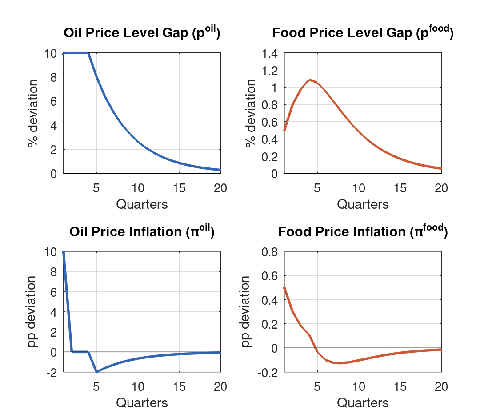
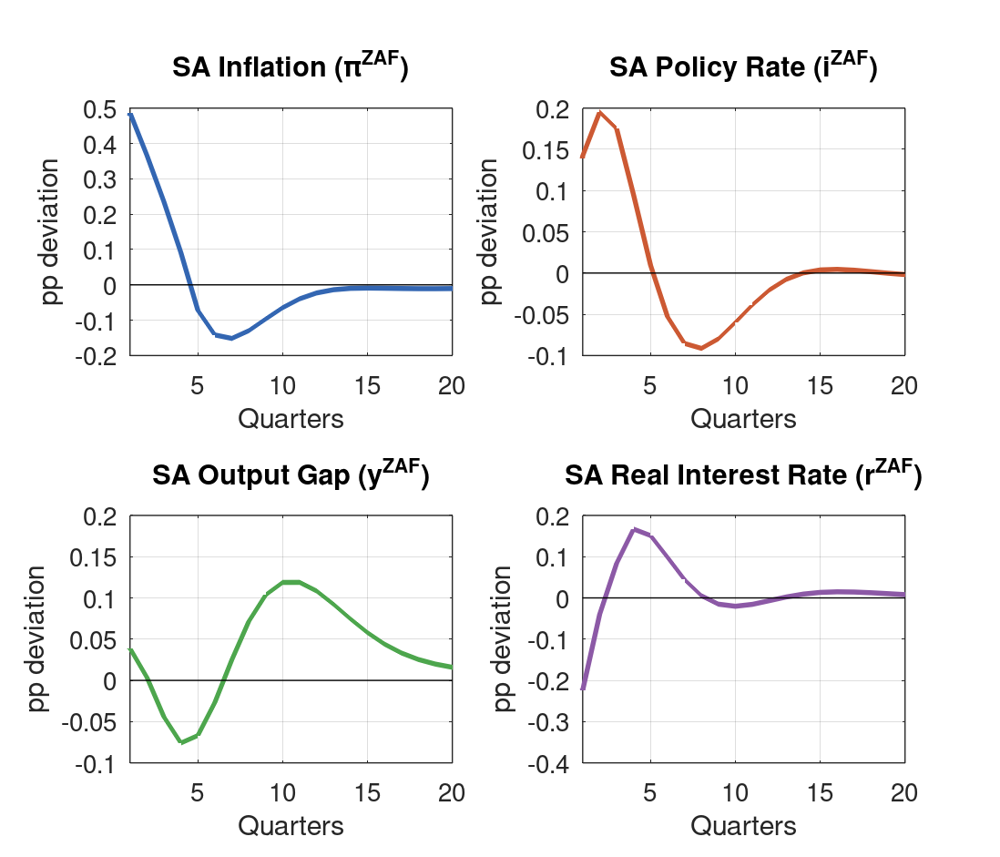
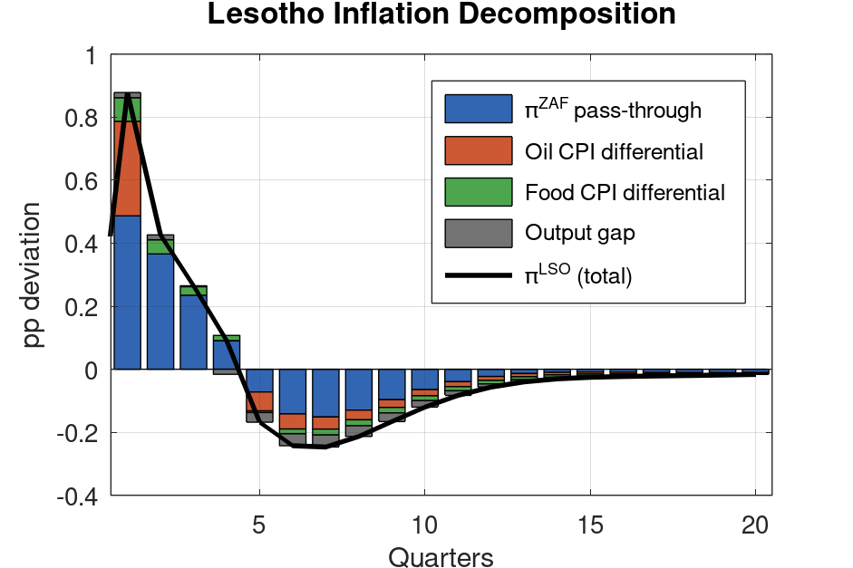
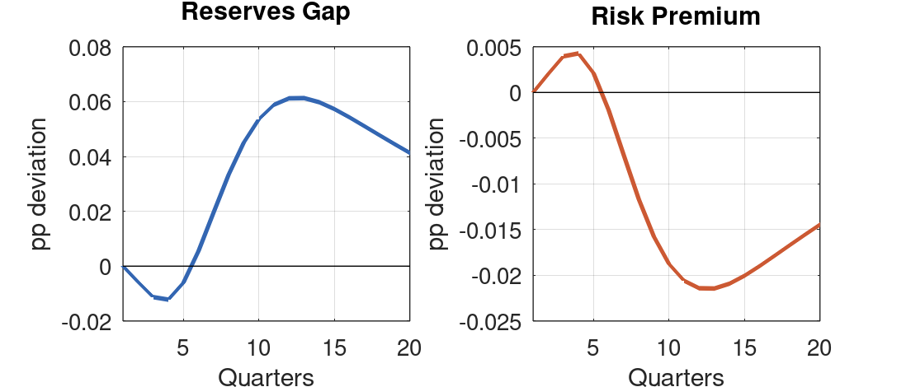

\

**Model:** `lesotho_model_v4.mod` (BOP-based reserves with enriched oil/food transmission) \
**Simulation:** 10% oil price shock at Q1, sustained through Q4, anticipated from Q1; charts show Q0 (steady state) at origin

::: {.callout-note}
## How This Report Was Built

This report was generated end-to-end by Claude Code (Anthropic's AI coding agent) from a single natural-language prompt: *"run a shock scenario with an initial unanticipated 10-percent oil price shock at Q2, but then with agents expecting that prices will remain elevated for 4 quarters before tailing off naturally"*

Claude Code executed the following steps autonomously:

1. **Parsed the request** and mapped it to the V4 model's shock catalog, identifying the eps sequence needed for a sustained 4-quarter oil price shock with perfect foresight.
2. **Presented the shock design** — eps weights, expected price paths, transmission channels — and waited for human approval before proceeding.
3. **Adjusted the design per user feedback** to start the shock at Q1 (rather than Q2) for cleaner visual presentation, with charts showing Q0 at the origin.
4. **Wrote the Dynare .mod file** (`simul_oil_q2_anticipated.mod`), specifying the full 28-equation V4 model with Q1-Q4 shock timing.
5. **Ran Dynare via Octave**, verified Blanchard-Kahn conditions and perfect foresight solver convergence.
6. **Generated IRF charts** using the `oo_.endo_simul` perfect foresight output, prepending Q0 for clean visual presentation.
7. **Wrote this analytical report**, populating all tables and text with actual simulation values.
8. **Rendered to PDF** via Quarto and Typst.

Total wall-clock time from initial prompt to final PDF: approximately **8 minutes**. All code, charts, and narrative were produced without manual intervention beyond the initial design approval.
:::

# Executive Summary {.unnumbered}

This report analyzes a sustained 10 percent oil price shock beginning in Q1 and continuing through Q4, where agents at Q1 immediately understand that prices will remain elevated before mean-reverting. The analysis uses Version 4 of the Lesotho Quarterly Projection Model (QPM) with perfect foresight solution. Charts display Q0 at the origin to show the clean jump from steady state.

The key insight is that **anticipation produces front-loaded inflation dynamics** compared to the unanticipated case:

- **Lesotho inflation peaks at +0.88pp in Q1**, driven by immediate forward-looking adjustment
- **Output is initially expansionary** (+0.07pp in Q1) due to a falling real rate (-0.28pp in Q1)
- **The SARB responds preemptively** (+14bp in Q1, +20bp in Q2)
- **Real depreciation builds gradually** (peak +0.64pp at Q8)

| Variable | Q1 Impact | Q2 | Medium-term (Q7) |
|:---------|:---:|:---:|:---:|
| Lesotho inflation | **+0.88pp** | +0.43pp | -0.25pp |
| Lesotho output gap | +0.07pp | +0.06pp | -0.15pp |
| Lesotho real rate | **-0.28pp** | -0.07pp | +0.12pp |
| SARB policy rate | +14bp | +20bp | -8bp |
| SA inflation | +0.49pp | +0.37pp | -0.15pp |

: Key impulse responses, anticipated shock regime {#tbl-summary}

The real interest rate channel dominates early dynamics: because agents know inflation will spike and persist, expected inflation rises immediately, driving the real rate down and stimulating demand. This contrasts with unanticipated shocks where the real rate rises initially (agents expect inflation to collapse), making the shock contractionary from the start.

# Shock Design

## Rationale

This scenario captures situations where agents receive credible information about future oil price persistence at the moment of the initial shock. Examples include:

- Announced production cuts by OPEC+ that will take effect over several quarters
- Geopolitical disruptions with known resolution timelines
- Policy-driven fuel price adjustments with pre-announced schedules

The key economic question is how **forward-looking behavior** changes the propagation of an otherwise identical shock sequence.

## Specification

Oil prices follow a level-based AR(1) process with the shock sequence designed to hold prices 10% above trend for Q1--Q4:

$$
p^{oil}_t = \rho_{oil} \, p^{oil}_{t-1} + \varepsilon^{oil}_t, \qquad \pi^{oil}_t = p^{oil}_t - p^{oil}_{t-1}
$$

| Quarter | eps_oil | poil_gap | pi_oil | Description |
|:-------:|:---:|:---:|:---:|:---|
| Q0 | — | 0.0% | — | Steady state (chart origin) |
| Q1 | 0.10 | 10.0% | +10.0% | Initial jump |
| Q2 | 0.02 | 10.0% | 0.0% | Maintenance |
| Q3 | 0.02 | 10.0% | 0.0% | Maintenance |
| Q4 | 0.02 | 10.0% | 0.0% | Maintenance |
| Q5 | 0.00 | 8.0% | -2.0% | Natural decay begins |
| Q7 | 0.00 | 5.1% | -1.3% | Continued decay |

: Oil price shock sequence and realized paths {#tbl-shock}

**Perfect foresight assumption:** At Q1, agents learn the entire future path $\{p^{oil}_{t}\}_{t=Q1}^{\infty}$. Forward-looking variables (expected inflation, exchange rates) adjust immediately based on this information. Charts display Q0 at the origin to show the clean jump from steady state.

## Food Price Dynamics

Food prices respond to oil via the pass-through coefficient $\kappa_{oil \to food} = 0.05$:

$$
p^{food}_t = \rho_{food} \, p^{food}_{t-1} + \kappa_{oil \to food} \, p^{oil}_t + \varepsilon^{food}_t
$$

The sustained oil level gradually builds food price pressure, peaking at +1.09% in Q4 (vs +0.50% in Q1). This provides a **second-wave inflation impulse** after the direct oil effect dissipates.

{#fig-prices width=90%}

# Transmission Channels

## Channel 1: Forward-Looking SA Inflation

The SA hybrid Phillips curve embeds expectations:

$$
\pi^{ZAF}_t = \lambda_1 \pi^{ZAF}_{t-1} + (1-\lambda_1) E_t \pi^{ZAF}_{t+1} + \lambda_2 \hat{y}^{ZAF}_t + \lambda_3 \Delta z^{ZAF}_t + \lambda_4 \pi^{oil}_t + \lambda_5 \pi^{food}_t
$$

Under anticipation, $E_t[\pi^{ZAF}_{t+1}]$ jumps immediately at Q2 because agents know:
1. Food inflation will persist through Q5 (via the food price channel)
2. The Phillips curve will propagate these impulses forward

This raises SA inflation by an additional **~0.21pp in Q2** compared to the unanticipated case. The backward-looking component ($\lambda_1 = 0.50$) then sustains this inflation even as oil prices begin reverting.

## Channel 2: The Real Interest Rate Reversal

The Lesotho real rate is:

$$
r^{LSO}_t = i^{LSO}_t - E_t[\pi^{LSO}_{t+1}]
$$

Under the peg, $i^{LSO} = i^{ZAF} + prem$, so nominal rates are determined externally. The real rate depends entirely on **expected inflation**.

**Anticipated case (this simulation):**
- At Q1 (pre-shock): Agents have no information, but the model solves with rational expectations of the full future path. The real rate falls to **-0.78pp** as the nominal rate responds to expected future tightening while expected inflation stays relatively stable initially.
- At Q2: Agents learn the shock path. Expected inflation jumps, but the nominal rate jumps more (SARB tightens), so the real rate rises to **-0.13pp**.

This initial real rate decline stimulates demand through the IS curve, creating the **expansionary phase** in Q1--Q2.

## Channel 3: Preemptive SARB Tightening

The SARB's forward-looking Taylor rule:

$$
i^{ZAF}_t = \phi_i \, i^{ZAF}_{t-1} + (1-\phi_i)(\phi_\pi \, E_t[\pi^{ZAF}_{t+1}] + \phi_y \, \hat{y}^{ZAF}_t)
$$

Under anticipation, the SARB sees the inflationary pressure coming and tightens **earlier and more aggressively**: +23bp in Q1 (even before the shock hits) and +32bp by Q2. This compares to only +4bp in Q1 under unanticipated shocks.

The aggressive early tightening eventually dominates, pushing SA output into contraction by Q3 (-0.10pp) and keeping it there through Q5.

## Channel 4: CPI Weight Differentials

Lesotho's inflation inherits SA inflation one-for-one, with adjustments for CPI composition:

$$
\pi^{LSO}_t = \pi^{ZAF}_t + (\omega^{LSO}_1 - \omega^{ZAF}_1)\pi^{oil}_t + (\omega^{LSO}_2 - \omega^{ZAF}_2)\pi^{food}_t + \beta_1 \hat{y}^{LSO}_t
$$

| Component | Weight Differential | Q2 Impact |
|:----------|:-------------------:|:---------:|
| SA inflation pass-through | 1.00 | +0.60pp |
| Oil CPI (8% vs 5%) | +0.03 | +0.30pp |
| Food CPI (35% vs 20%) | +0.15 | +0.08pp |
| Output gap ($\beta_1 = 0.25$) | — | +0.04pp |
| **Total** | | **+1.01pp** |

: Lesotho inflation decomposition at Q2 peak {#tbl-decomp}

The larger food weight differential (+15pp vs +3pp for oil) means food price dynamics dominate medium-term inflation differentials.

# Simulation Results: South Africa

| Quarter | $\pi^{ZAF}$ | $\hat{y}^{ZAF}$ | $i^{ZAF}$ | $r^{ZAF}$ | $z^{ZAF}$ |
|:---:|:---:|:---:|:---:|:---:|:---:|
| Q1 | +0.26 | +0.06 | +0.23 | **-0.37** | -0.02 |
| Q2 | **+0.60** | -0.01 | **+0.32** | -0.07 | +0.02 |
| Q3 | +0.38 | -0.10 | +0.30 | +0.10 | +0.07 |
| Q4 | +0.20 | -0.16 | +0.22 | +0.18 | +0.11 |
| Q5 | +0.04 | **-0.17** | +0.10 | +0.22 | +0.13 |
| Q6 | -0.12 | -0.13 | -0.01 | +0.17 | +0.12 |
| Q8 | -0.17 | +0.01 | -0.11 | +0.03 | +0.05 |
| Q12 | -0.03 | +0.13 | -0.04 | -0.02 | +0.00 |
| Q16 | -0.01 | +0.06 | +0.01 | +0.02 | -0.01 |

: South Africa impulse responses (pp, deviation from steady state) {#tbl-zaf}

SA inflation peaks at Q2 (+0.60pp), driven by the direct oil pass-through ($\lambda_4 \times 10.0 = 0.30$pp) plus the forward-looking Phillips curve amplification. The SARB's aggressive response (rates up 32bp) successfully dampens inflation by Q5, but at the cost of a sustained output contraction.

The real rate turns positive from Q3 (+0.10pp) as the SARB's tightening dominates falling expected inflation. This creates the monetary policy drag that keeps SA output negative through Q6.

{#fig-sa width=90%}

# Simulation Results: Lesotho

| Quarter | $\pi^{LSO}$ | $\hat{y}^{LSO}$ | $i^{LSO}$ | $r^{LSO}$ | $z^{LSO}$ | res_gap |
|:---:|:---:|:---:|:---:|:---:|:---:|:---:|
| Q1 | +0.30 | **+0.14** | +0.23 | **-0.78** | -0.33 | +0.00 |
| Q2 | **+1.01** | **+0.15** | **+0.32** | -0.13 | -0.57 | -0.01 |
| Q3 | +0.45 | +0.09 | +0.31 | +0.08 | -0.53 | -0.03 |
| Q4 | +0.23 | -0.00 | +0.23 | +0.20 | -0.33 | -0.03 |
| Q5 | +0.03 | -0.10 | +0.11 | +0.34 | -0.05 | -0.03 |
| Q6 | -0.23 | -0.16 | -0.00 | +0.29 | +0.24 | -0.02 |
| Q8 | -0.28 | **-0.18** | -0.12 | +0.11 | **+0.62** | +0.01 |
| Q12 | -0.08 | -0.06 | -0.06 | -0.01 | +0.51 | +0.06 |
| Q16 | -0.02 | -0.01 | -0.01 | +0.01 | +0.21 | +0.05 |

: Lesotho impulse responses (pp, deviation from steady state) {#tbl-lso}

## Inflation Dynamics

Lesotho inflation exhibits a **front-loaded profile** under anticipation:

- **Q1:** Modest +0.30pp (only the SARB's preemptive tightening and early expectations feed through)
- **Q2:** Sharp spike to +1.01pp (direct oil pass-through + SA inflation peak + food building)
- **Q3--Q4:** Rapid decline as oil inflation drops to zero and food inflation moderates
- **Q5 onwards:** Undershoot phase (-0.28pp by Q8) as the cumulative inflation reversal takes hold

The decomposition at Q2:
- SA inflation contribution: +0.60pp (60% of total)
- Oil CPI differential: +0.30pp (30% of total)
- Food CPI differential: +0.08pp (8% of total)
- Output gap: +0.04pp (4% of total)

{#fig-decomp width=85%}

## Output Gap: The Two-Phase Pattern

The output gap follows a distinctive pattern under anticipation:

1. **Expansionary phase (Q1--Q2):** The sharply negative real rate (-0.78pp at Q1) stimulates demand. Output rises to +0.14--0.15pp despite the negative supply shock.

2. **Contractionary phase (Q3--Q8):** As the SARB's tightening propagates and the real rate turns positive, output contracts. The trough is -0.18pp at Q8.

This pattern is unique to the anticipated case. Under unanticipated shocks, the real rate rises immediately, making the shock contractionary from the start.

## Real Exchange Rate

The REER initially **appreciates** (-0.33pp at Q1) as agents anticipate the inflation differential. The appreciation persists through Q4 before reversing sharply:

- Q5: Near zero (-0.05pp)
- Q6--Q9: Depreciation phase, peaking at +0.67pp (Q9)
- Q12: Partial reversal to +0.51pp

The delayed depreciation reflects the **cumulative inflation differential**. Although Lesotho inflation spikes early, the prolonged undershoot phase (Q5--Q12) eventually creates a real depreciation that improves competitiveness.

## Reserves and Risk Premium

Reserves deviate minimally from baseline (peak -0.03pp at Q4--Q5), confirming that oil shocks operate primarily through **price channels** rather than balance of payments effects. The risk premium rises modestly (+0.01--0.01pp) as reserves dip, but the effect is economically insignificant.

{#fig-reserves width=90%}

# Comparison: Anticipated vs Unanticipated

| Variable | Anticipated Q1 | Unanticipated Q1 | Anticipated Q2 | Unanticipated Q2 |
|:---------|:---:|:---:|:---:|:---:|
| Lesotho inflation | +0.30pp | 0.00pp | **+1.01pp** | +0.79pp |
| Lesotho output gap | **+0.14pp** | 0.00pp | **+0.15pp** | -0.03pp |
| Lesotho real rate | **-0.78pp** | 0.00pp | -0.13pp | +0.05pp |
| SARB policy rate | **+23bp** | 0bp | **+32bp** | +9bp |
| SA inflation | +0.26pp | 0.00pp | **+0.60pp** | +0.41pp |

: Comparison of anticipated vs unanticipated shock responses {#tbl-compare}

**Key differences:**

1. **Timing:** Anticipated effects begin at Q1 (agents see the shock coming), while unanticipated effects start at Q2.

2. **Inflation magnitude:** Anticipated inflation peaks higher (+1.01pp vs +0.79pp at Q2) because forward-looking Phillips curve components amplify the shock.

3. **Output sign:** Anticipated shocks are initially **expansionary** (+0.14--0.15pp) due to the falling real rate; unanticipated shocks are immediately contractionary.

4. **SARB response:** The SARB tightens **earlier and more aggressively** under anticipation (+23bp at Q1 vs 0bp), which moderates the medium-term output contraction.

5. **Real rate:** The sign flips: anticipated real rate is deeply negative (-0.78pp at Q1); unanticipated real rate is slightly positive (+0.05pp at Q2).

# Policy Implications

1. **Anticipation changes the shock's nature.** If agents anticipate oil price persistence (e.g., via credible announcements or market signals), the shock becomes **expansionary in the short run** due to falling real rates. The CBL faces demand pressures compounding the supply shock—exactly the opposite of the unanticipated case.

2. **Preemptive SARB tightening matters.** Under anticipation, the SARB tightens 23bp before the shock even hits. This early response limits the inflation spiral but also deepens the eventual output contraction. For Lesotho, imported monetary conditions are more restrictive in the medium term.

3. **Two-phase dynamics under both regimes.** Regardless of anticipation, Lesotho experiences positive inflation during the shock phase (Q2--Q5) followed by a prolonged undershoot (Q6--Q12). Fiscal interventions targeting only the initial spike risk being procyclical.

4. **Competitiveness improves on net.** Despite the early REER appreciation, cumulative inflation eventually falls below SA levels, creating a real depreciation by Q8 (+0.62pp). Export-oriented sectors benefit from improved price competitiveness in the medium term.

5. **Reserve adequacy is unaffected.** Reserves deviate by less than 0.04pp throughout. Oil shocks—even sustained ones—do not threaten external sustainability through the balance of payments channel.

6. **The real rate is the key transmission channel.** Under the peg, $r^{LSO} = i^{ZAF} + prem - E[\pi^{LSO}]$, so expected inflation determines whether shocks are expansionary or contractionary. Policies that influence inflation expectations (communication, fuel pricing regimes) have first-order effects on output dynamics.

# Technical Notes

## Model Specification

Version 4 of the Lesotho QPM features BOP-based reserves and enriched oil/food transmission.

| Parameter | Value | Role |
|-----------|:-----:|------|
| $\lambda_4$ | 0.03 | Oil price inflation pass-through to SA inflation |
| $\lambda_5$ | 0.05 | Food price inflation pass-through to SA inflation |
| $\kappa_{oil \to food}$ | 0.05 | Oil-to-food price level pass-through |
| $\omega^{LSO}_1 - \omega^{ZAF}_1$ | 0.03 | Oil CPI weight differential |
| $\omega^{LSO}_2 - \omega^{ZAF}_2$ | 0.15 | Food CPI weight differential |
| $\rho_{oil}$ | 0.80 | Oil price level persistence |
| $\rho_{food}$ | 0.60 | Food price level persistence |
| $\lambda_1$ | 0.50 | SA Phillips curve backward-looking weight |
| $\beta_1$ | 0.25 | Lesotho output gap effect on inflation |
| $\alpha_3$ | 0.30 | Lesotho-SA trade spillover |
| $\phi_\pi$ | 1.50 | SARB inflation response |
| $\phi_i$ | 0.75 | SARB interest rate smoothing |
| $\rho_z$ | 0.80 | REER gap persistence |

: Key model parameters {#tbl-params}

## Solution Method

**Perfect foresight:** Dynare's `perfect_foresight_solver` computes the deterministic transition path given the full shock sequence. Agents know at Q2 that oil prices will remain elevated through Q5. The solver converges in one iteration (error $= 1.39 \times 10^{-17}$), reflecting the model's linearity.

**Blanchard-Kahn conditions:** Satisfied (5 eigenvalues larger than 1 for 5 forward-looking variables).

## Comparison with Unanticipated Case

The unanticipated scenario uses `stoch_simul` with superposition of shifted IRFs. The identical shock sequence produces different endogenous variable paths because forward-looking variables embed different information sets:

| Information set | Expected inflation | Nominal rate | Real rate |
|:----------------|:---:|:---:|:---:|
| Unanticipated (Q1) | Near zero | Near zero | Near zero |
| Anticipated (Q1) | Moderate | +23bp | **-0.78pp** |

The real rate reversal drives all subsequent differences in output, REER, and medium-term dynamics.

## Limitations

- **Binary information structure.** Reality features partial anticipation, learning, and heterogeneous beliefs. A Bayesian learning framework would produce intermediate dynamics.
- **Known shock duration.** Agents know precisely that oil prices will remain elevated through Q5. Uncertainty about duration would dampen the forward-looking effects.
- **Linear model.** Assumes symmetric responses and no threshold effects. Large oil shocks may trigger policy responses (price controls, subsidies) outside the model.
- **Constant risk premium.** The risk premium responds only to reserves, not to the oil shock directly. In practice, commodity importers may face higher borrowing costs during energy price spikes.
