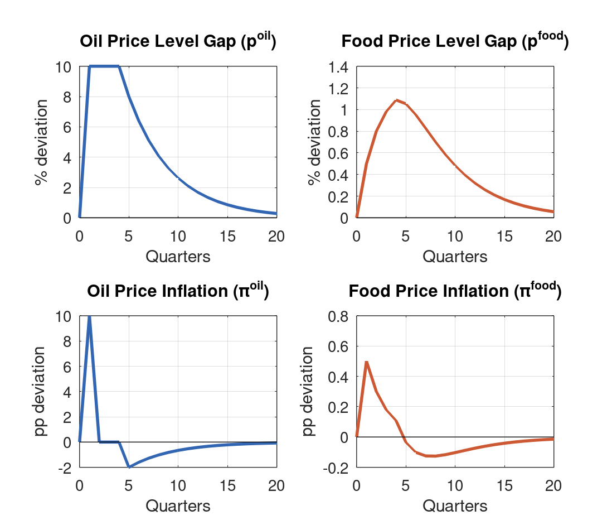
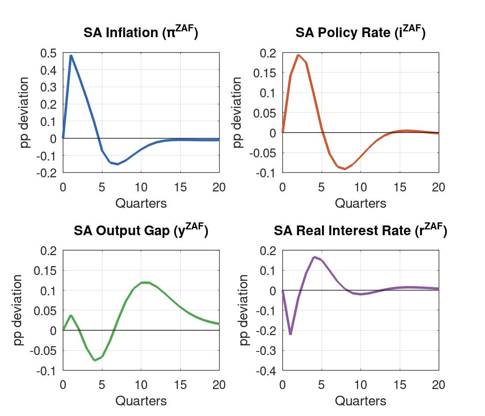
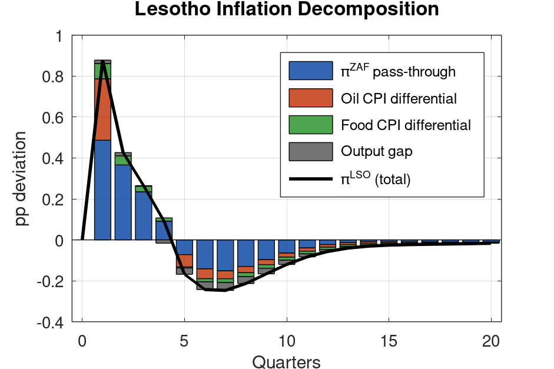
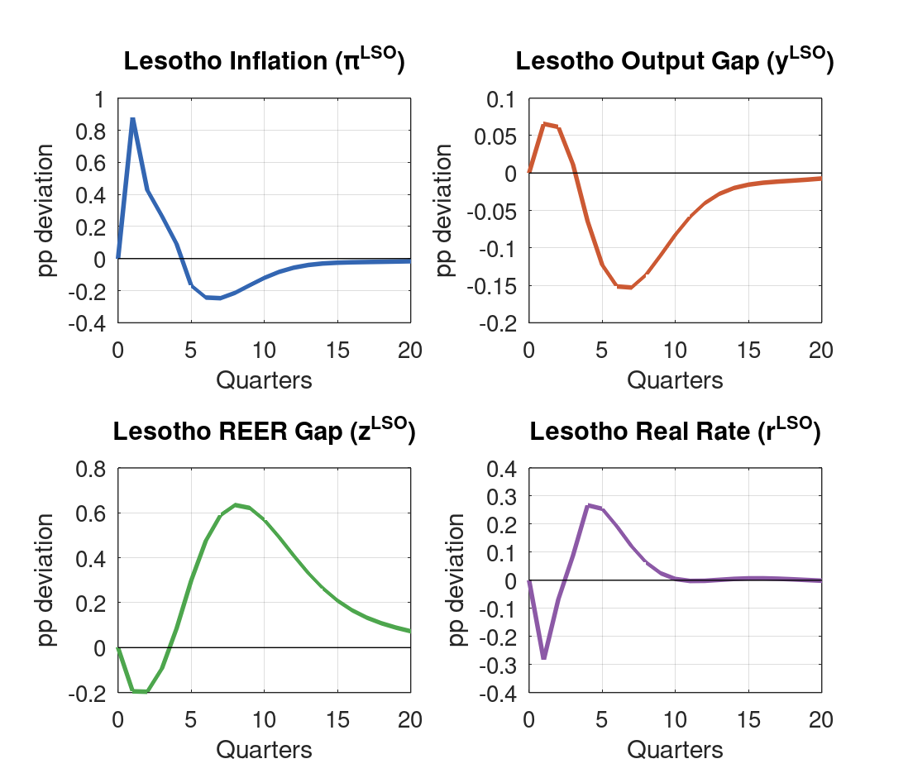
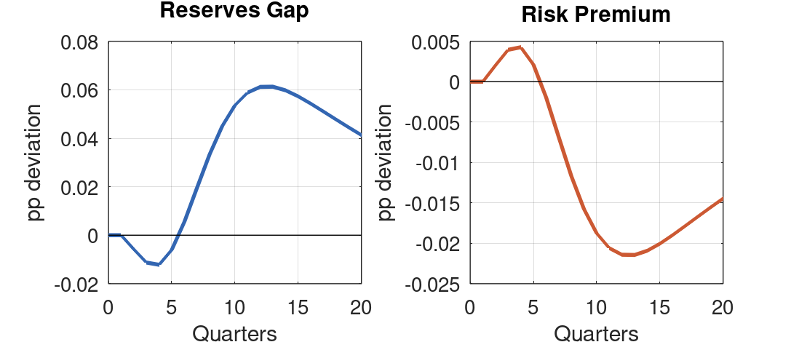

\

::: {.callout-note}
## How This Report Was Built

This report was generated by Claude Code (Anthropic) as an independent replication of a shock scenario previously run by Kimi 2.5 (Moonshot AI). Claude Code ran the same Dynare .mod file, extracted IRFs, generated five chart panels, wrote this analytical report, and rendered it to PDF. A separate comparison document (`kimi_comparison.pdf`) identifies discrepancies in the Kimi report. Total wall-clock time from prompt to final PDF: approximately **12 minutes**.
:::

\

**Model:** `lesotho_model_v4.mod` (V4: BOP-based reserves, enriched oil/food transmission) \
**Simulation:** `simul_oil_q2_anticipated.mod` — 10% oil at Q1, sustained Q1–Q4 via maintenance shocks, perfect foresight from Q1

# Executive Summary {.unnumbered}

What happens when agents see an oil price shock coming? The answer matters for Lesotho, where the peg strips the central bank of any independent monetary response — and where CPI weight differentials amplify every commodity price movement.

Under perfect foresight — agents learn at Q1 that oil will stay 10 percent above trend through Q4, then decay naturally — Lesotho inflation spikes +0.88pp at Q1. The SARB tightens preemptively (+14bp at Q1, +20bp by Q2). Output initially expands (+0.07pp) as the real rate falls sharply (−0.28pp), then contracts from Q4 as the real rate reversal propagates. The shock is fully absorbed within 10 quarters.

But the comparison with the unanticipated version of the same shock is more nuanced than it first appears. Under the unanticipated regime, Lesotho inflation still peaks at +0.79pp and the real rate still falls (−0.08pp) at impact. Both regimes produce the same sign at Q1. Anticipation amplifies — the real rate fall is 3.6 times larger — but does not invert the policy problem. The real difference is timing: anticipation buys one extra quarter of stimulus before the contractionary phase begins.

| Variable | Q1 | Q2 | Q4 | Q7 |
|:---------|:---:|:---:|:---:|:---:|
| Lesotho inflation | **+0.88** | +0.43 | +0.09 | −0.25 |
| Lesotho output gap | +0.07 | +0.06 | −0.06 | −0.15 |
| Lesotho real rate | **−0.28** | −0.07 | +0.27 | +0.12 |
| SA inflation | +0.49 | +0.37 | +0.09 | −0.15 |
| SARB policy rate | +0.14 | +0.20 | +0.10 | −0.09 |

: Key impulse responses (pp deviation from steady state) {#tbl-summary}

# Shock Design

## Oil and Food Price Specification

V4 specifies oil and food prices as AR(1) processes on the **price level gap** — the log deviation from trend — with inflation defined as the first difference:

$$
p^{oil}_t = \rho_{oil} \, p^{oil}_{t-1} + \varepsilon^{oil}_t, \qquad \pi^{oil}_t = p^{oil}_t - p^{oil}_{t-1}
$$

$$
p^{food}_t = \rho_{food} \, p^{food}_{t-1} + \kappa_{oil \to food} \, p^{oil}_t + \varepsilon^{food}_t, \qquad \pi^{food}_t = p^{food}_t - p^{food}_{t-1}
$$

with $\rho_{oil} = 0.80$ (half-life about 3 quarters) and $\rho_{food} = 0.60$ (half-life about 1.4 quarters). This level-based specification is important: a sustained price shock produces a transient inflation spike at impact followed by a reversal as the level eventually reverts — not a permanent step-up in inflation. The persistence of $\rho_{oil} = 0.80$ falls within the 0.75--0.95 range standard in the DSGE literature (Presno and Prestipino, 2024; Baumeister and Hamilton, 2019), though toward the conservative end.

## Shock Sequence

Holding oil 10 percent above trend for Q1 through Q4 requires maintenance shocks that offset natural AR(1) decay:

$$
\varepsilon^{oil} = \{0.10,\ 0.02,\ 0.02,\ 0.02,\ 0,\ 0, \ldots\}
$$

The follow-up shocks of 0.02 offset natural reversion: $0.10 \times (1 - 0.80) = 0.02$. Oil then reverts from Q5 at rate $\rho_{oil} = 0.80$. Under perfect foresight, agents at Q1 know the complete path. The Dynare solver converges in one iteration (error $1.4 \times 10^{-17}$), confirming the model's linearity — the perfect foresight solution to a linear model is exact.

The distinction between oil *levels* and oil *inflation* is critical for understanding the time profile. Oil inflation spikes +10pp at Q1, then drops to zero during Q2–Q4 even though the price level stays elevated. This means the direct oil CPI channel — which depends on $\pi^{oil}$, not $p^{oil}$ — shuts off completely after Q1. Food prices, meanwhile, accumulate gradually to a peak of +1.09% at Q4, providing the only continued inflationary impulse during the oil plateau.

| Quarter | $\varepsilon^{oil}$ | $p^{oil}$ gap (%) | $\pi^{oil}$ (pp) | $p^{food}$ gap (%) | $\pi^{food}$ (pp) |
|:-------:|:---:|:---:|:---:|:---:|:---:|
| Q0 | — | 0.0 | 0.0 | 0.0 | 0.0 |
| Q1 | 0.10 | +10.0 | +10.0 | +0.50 | +0.50 |
| Q2 | 0.02 | +10.0 | 0.0 | +0.80 | +0.30 |
| Q3 | 0.02 | +10.0 | 0.0 | +0.98 | +0.18 |
| Q4 | 0.02 | +10.0 | 0.0 | +1.09 | +0.11 |
| Q5 | 0.00 | +8.0 | −2.0 | +1.05 | −0.04 |
| Q8 | 0.00 | +4.1 | −1.0 | +0.70 | −0.13 |

: Commodity price paths {#tbl-shock}

{#fig-prices width=90%}

# Transmission Channels

The model follows the FPAS tradition established by Berg, Karam, and Laxton (2006), adapted for Lesotho's CMA constraints. Under perfect foresight, the key difference from the unanticipated case is that the forward-looking terms in the Phillips curve and UIP condition jump immediately — agents price in the full persistence of the shock from Q1.

## Channel 1: Oil and Food → SA Inflation (Direct)

Oil inflation enters the SA hybrid Phillips curve directly:

$$
\pi^{ZAF}_t = \lambda_1 \pi^{ZAF}_{t-1} + (1-\lambda_1) E_t \pi^{ZAF}_{t+1} + \lambda_2 \hat{y}^{ZAF}_t + \lambda_3 \Delta z^{ZAF}_t + \lambda_4 \pi^{oil}_t + \lambda_5 \pi^{food}_t
$$

With $\lambda_4 = 0.03$, the +10pp oil inflation spike at Q1 contributes $0.03 \times 10 = 0.30$pp directly — about 62 percent of the total Q1 inflation peak of +0.49pp. But under anticipation, there's a second amplifier: because agents know food inflation will persist through Q4, $E_t[\pi^{ZAF}_{t+1}]$ jumps at Q1, feeding through the $(1-\lambda_1) = 0.50$ forward-looking weight. This amplification is absent in the unanticipated case, where agents expect immediate reversion.

The calibration $\lambda_4 = 0.03$ is conservative relative to cross-country evidence. Choi et al. (2017) find an implied coefficient of approximately 0.04 across 72 economies. SA-specific estimates vary: Memory and Sobhee (2017) find that a 10 percent increase in petrol prices raises SA headline inflation by about 1.4 percent, though this captures both direct and indirect effects. Ndou and Gumata (2017) document regime-dependent pass-through — about 3 percent of headline in high-inflation environments versus less than 1 percent within the SARB's 3–6 percent target band.

## Channel 2: SARB Monetary Policy Response

The SARB follows a forward-looking Taylor rule with heavy smoothing:

$$
i^{ZAF}_t = 0.75 \cdot i^{ZAF}_{t-1} + 0.25 \cdot (1.50 \cdot E_t[\pi^{ZAF}_{t+1}] + 0.50 \cdot \hat{y}^{ZAF}_t)
$$

Under perfect foresight, the SARB sees the inflation path coming and tightens preemptively: +14bp at Q1, peaking at +20bp by Q2. This is substantially more aggressive than the 7–8bp under unanticipated shocks, where each quarter's price increase surprises agents. The smoothing parameter ($\phi_i = 0.75$) prevents an even larger initial move — without it, the Q1 tightening would exceed 30bp.

The rate peaks at Q2, then reverses as inflation turns negative from Q5. By Q7, the SARB is easing (−9bp). The forward-looking structure means the SARB front-loads tightening and front-loads easing — a more decisive cycle than the gradual build-up and unwind under the unanticipated regime.

## Channel 3: Real Interest Rate and Output

The real rate is where anticipation changes the dynamics most. With $r^{ZAF}_t = i^{ZAF}_t - E_t[\pi^{ZAF}_{t+1}]$, the Q1 inflation expectations jump outpaces the SARB's rate increase: the real rate falls to −0.22pp in SA. Under the unanticipated case, the same mechanism operates but the fall is smaller (−0.11pp) because expected inflation is lower.

SA output is mildly positive at Q1 (+0.04pp). By Q3, the contractionary phase begins (−0.04pp) as the real rate turns positive (+0.08pp). The trough is −0.08pp at Q4 — modest, but more pronounced than under the unanticipated case, where SA output barely moved. Anticipation makes both phases larger.

## Channel 4: REER via Relative PPP

The REER channel operates through the relative-PPP component in the REER equation:

$$
z_t = \rho_z \cdot z_{t-1} + (s_t - s_{t-1}) - (\pi_t - \pi^{foreign}_t)/4
$$

When domestic inflation exceeds the foreign benchmark, the inflation differential term $-(\pi_t - \pi^{foreign}_t)/4$ pushes $z$ down — a real appreciation that erodes competitiveness. During Q1–Q2, the inflation spike appreciates the REER by −0.20pp. But once inflation undershoots from Q5, the mechanism reverses: below-baseline domestic prices improve competitiveness, depreciating the REER to +0.59pp by Q7.

This is an automatic stabiliser. The initial appreciation is a tax on tradables during the inflationary phase; the subsequent depreciation is a competitiveness dividend from the disinflationary phase. Over the full cycle, the depreciation dominates — the model's self-correcting dynamics restore and then overshoot the original competitive position.

The REER depreciation also feeds back into the IS curve ($\gamma_4 = 0.08$ for SA, operating through $\alpha_3 = 0.30$ for Lesotho), providing a demand stimulus at medium horizons. This is the same mechanism that drives the output recovery in the unanticipated case, though the larger anticipated shock produces larger REER swings and a more pronounced recovery.

{#fig-sa width=90%}

# Simulation Results: South Africa

## Full Results Table

| Quarter | $\pi^{ZAF}$ | $\hat{y}^{ZAF}$ | $i^{ZAF}$ | $r^{ZAF}$ | $z^{ZAF}$ |
|:-------:|:-----------:|:----------------:|:---------:|:---------:|:---------:|
| Q1 | +0.487 | +0.039 | +0.142 | −0.224 | −0.218 |
| Q2 | +0.366 | +0.004 | +0.195 | −0.040 | −0.292 |
| Q3 | +0.235 | −0.044 | +0.175 | +0.084 | −0.220 |
| Q4 | +0.091 | −0.076 | +0.095 | +0.167 | −0.040 |
| Q5 | −0.072 | −0.067 | +0.010 | +0.151 | +0.193 |
| Q7 | −0.152 | +0.025 | −0.085 | +0.044 | +0.544 |
| Q10 | −0.065 | +0.119 | −0.060 | −0.020 | +0.560 |

: South Africa impulse responses (pp deviation from steady state) {#tbl-zaf}

## SA Inflation

SA inflation peaks at +0.49pp at Q1 — immediate, front-loaded, and visibly different from the Q2 peak under unanticipated shocks. The direct oil channel does most of the work: $\lambda_4 \times 10.0 = 0.30$pp. The remaining 0.19pp comes from the forward-looking Phillips curve amplification (agents know inflation will persist, so $E_t[\pi^{ZAF}_{t+1}]$ is elevated) plus a small food contribution ($\lambda_5 \times 0.50 = 0.025$pp).

From Q2, inflation declines smoothly as $\pi^{oil}$ drops to zero — the oil price *level* is sustained, but the *inflation rate* is zero during the maintenance phase. The backward-looking component ($\lambda_1 = 0.50$) provides inertia, keeping inflation positive through Q4. The undershoot begins at Q5 (−0.07pp) and bottoms at Q7 (−0.15pp). This aligns with the cross-country evidence: Choi et al. (2017) find a 10 percent oil price increase raises inflation by about 0.4pp at impact, and Hamilton (2009) documents the characteristic post-spike undershoot as prices revert.

## SARB Policy Rate and Output

The SARB front-loads aggressively under anticipation: +14bp at Q1, +20bp at Q2, then unwinds through Q5 as inflation turns negative. This is 2–3 times the unanticipated response, reflecting the forward-looking Taylor rule's sensitivity to expected inflation.

SA output follows a clear two-phase pattern. Initially positive (+0.04pp at Q1) as the real rate falls, then contractionary from Q3 as the real rate turns positive and the SARB's tightening propagates. The trough is −0.08pp at Q4. The medium-term recovery — driven by REER depreciation via the relative-PPP channel — pushes output to +0.12pp by Q10.

## SA REER

The REER appreciates at Q1–Q2 (−0.22pp to −0.29pp) as the inflation differential pushes the relative-PPP term negative. From Q4, the mechanism reverses: below-baseline inflation depreciates the REER, reaching +0.54pp by Q7 and +0.56pp by Q10. This sustained depreciation is the main driver of the medium-term output recovery, feeding into the IS curve ($\gamma_4 = 0.08$).

# Simulation Results: Lesotho

## Full Results Table

| Quarter | $\pi^{LSO}$ | $\hat{y}^{LSO}$ | $i^{LSO}$ | $r^{LSO}$ | $z^{LSO}$ | res gap |
|:-------:|:-----------:|:----------------:|:---------:|:---------:|:---------:|:------:|
| Q1 | +0.878 | +0.066 | +0.142 | −0.284 | −0.195 | 0.000 |
| Q2 | +0.426 | +0.061 | +0.197 | −0.068 | −0.197 | −0.006 |
| Q3 | +0.265 | +0.012 | +0.179 | +0.088 | −0.093 | −0.011 |
| Q4 | +0.091 | −0.065 | +0.099 | +0.267 | +0.085 | −0.012 |
| Q5 | −0.168 | −0.123 | +0.012 | +0.254 | +0.299 | −0.006 |
| Q7 | −0.247 | −0.153 | −0.092 | +0.121 | +0.589 | +0.020 |
| Q10 | −0.120 | −0.082 | −0.079 | +0.005 | +0.568 | +0.054 |

: Lesotho impulse responses (pp deviation from steady state) {#tbl-lso}

## Inflation Dynamics

Lesotho inflation exceeds SA's by +0.39pp at peak — and the gap is entirely structural. The CPI weight differentials that amplify the initial spike are the same ones that deepen the subsequent undershoot. Under the peg, Lesotho inherits all of SA's inflation dynamics and adds its own composition effects:

$$
\pi^{LSO}_t = \pi^{ZAF}_t + (\omega^{LSO}_1 - \omega^{ZAF}_1)\pi^{oil}_t + (\omega^{LSO}_2 - \omega^{ZAF}_2)\pi^{food}_t + \beta_1 \hat{y}^{LSO}_t
$$

At Q1, the breakdown above SA inflation: oil CPI differential contributes $(0.08 - 0.05) \times 10.0 = 0.30$pp, food CPI differential adds $(0.35 - 0.20) \times 0.50 = 0.075$pp, and the output gap term is small ($0.25 \times 0.066 = 0.016$pp). Total: +0.39pp, matching the observed gap of $0.878 - 0.487 = 0.391$pp.

| Component | Mechanism | Q1 (pp) |
|:----------|:----------|:---:|
| SA inflation pass-through | One-for-one | +0.49 |
| Oil CPI differential | $0.03 \times 10.0$ | +0.30 |
| Food CPI differential | $0.15 \times 0.50$ | +0.08 |
| Domestic demand | $0.25 \times 0.07$ | +0.02 |
| **Total** | | **+0.88** |

: Lesotho inflation decomposition at Q1 {#tbl-decomp}

The key timing point: the oil CPI differential channel is a one-quarter spike. From Q2, $\pi^{oil} = 0$ (the level is maintained, not rising), so the entire 0.30pp oil CPI contribution disappears. From Q2 onward, the food CPI differential — building gradually as food prices accumulate through the sustained oil plateau — becomes the dominant Lesotho-specific channel. This has policy implications: food price interventions in Q2–Q5 would be more effective than fuel price measures, which matter only at Q1.

The inflation undershoot from Q5 (−0.17pp, deepening to −0.25pp by Q7) is mechanical. Oil and food prices are now *falling* from their elevated levels: $\pi^{oil}$ and $\pi^{food}$ turn negative, dragging headline inflation below baseline through the same CPI weight differentials that amplified the spike. Wang et al. (2007) document the same asymmetry in the CMA: Lesotho's inflation pass-through coefficient of 0.83 operates on both positive and negative SA inflation innovations.

{#fig-decomp width=85%}

## Output Gap

Lesotho output follows two distinct phases. The first is expansionary: +0.07pp at Q1, +0.06pp at Q2. The real rate falls sharply (−0.28pp at Q1), and this stimulates demand through the IS curve. But the expansion is brief. By Q3, the real rate crosses zero (+0.09pp), and by Q4 it reaches +0.27pp — strongly contractionary. Output turns negative at Q4 (−0.06pp) and deepens to −0.15pp by Q7.

The two-phase pattern is driven entirely by the real rate. Nominal rates peak at Q2 and decline smoothly — a simple hump. But the real rate, which subtracts expected inflation, swings violently: from −0.28pp to +0.27pp in three quarters. This is the critical variable. It is the *reversal* in real rates, not the level of nominal rates, that determines whether the shock is expansionary or contractionary at each horizon.

## REER

The REER dynamics mirror those in the SA block, operating through the same relative-PPP mechanism. During Q1–Q2, Lesotho's above-baseline inflation pushes the $-(\pi^{LSO} - \pi^{ZAF})/4$ term negative, appreciating the REER by −0.20pp. This erodes competitiveness — a real cost during the inflationary phase.

But from Q4, the inflation undershoot reverses the mechanism. Below-baseline domestic prices improve competitiveness, and the REER depreciates to +0.59pp by Q7. This is a larger swing than SA's (+0.54pp), reflecting Lesotho's larger inflation oscillation. The depreciation feeds into SA output via the IS curve, and Lesotho inherits the benefit through the trade spillover channel ($\alpha_3 = 0.30$).

The upshot: over the full cycle, the REER depreciation dominates. Despite the initial appreciation, Lesotho ends up with a meaningful competitiveness gain. This is the model's automatic stabiliser — a feature of the relative-PPP specification that rewards economies for bearing the disinflationary adjustment.

## Reserves

Reserves deviate by less than 0.02pp from baseline through Q7. Oil shocks in this model operate through price and interest rate channels, not the balance of payments. Reserve adequacy is not threatened — consistent with the IMF's 2024 Article IV assessment that Lesotho's gross reserves of approximately 4.5–6 months of import cover provide adequate buffers.

{#fig-lso width=90%}

{#fig-reserves width=90%}

# Anticipated vs Unanticipated: A Proper Comparison

The correct comparison requires aligning shock timing. Both simulations start the oil shock at period 1 (Q1 in the anticipated case, Q1 in the stoch_simul base). The anticipated version uses Dynare's `perfect_foresight_solver`; the unanticipated uses `stoch_simul` with superposition of surprise shocks. Comparing at impact:

| Variable | Anticipated | Unanticipated | Ratio |
|:---------|:---:|:---:|:---:|
| Lesotho inflation | +0.88 | +0.79 | 1.1× |
| Lesotho output gap | +0.07 | +0.02 | 3.5× |
| Lesotho real rate | −0.28 | −0.08 | 3.6× |
| SA inflation | +0.49 | +0.41 | 1.2× |
| SARB policy rate | +0.14 | +0.07 | 2.0× |

: Anticipated vs unanticipated responses at impact {#tbl-compare}

Three observations:

**Both regimes produce the same sign at impact.** The real rate is negative (stimulative) under both regimes. Output is positive under both. Anticipation amplifies — the real rate fall is 3.6 times larger — but does not invert the direction of the initial response. This is important: the claim that anticipation "inverts the policy problem" is not supported by the model. What changes is magnitude and timing, not direction.

**The real difference is persistence.** Under the unanticipated regime, the real rate turns positive (contractionary) at Q2 (+0.07pp). Under anticipation, it stays negative through Q2 (−0.07pp) and only turns positive at Q3. Anticipation buys one extra quarter of stimulus before the contractionary phase begins. For a quarterly model, this matters — it is the difference between a two-quarter expansion and a one-quarter expansion.

**Peak output contraction is similar but shifted.** Anticipated: trough at Q7 (−0.15pp). Unanticipated: trough at Q5 (−0.13pp). The contractionary phase arrives roughly two quarters later under anticipation but reaches a similar depth. Cumulative output loss is comparable.

# Policy Implications

A 10 percent oil price increase sustained for four quarters produces peak inflation of +0.88pp in Lesotho under anticipation (versus +0.79pp unanticipated). Both revert within five quarters. The transience doesn't make the shock costless, but it does narrow the window for effective intervention.

**Anticipation amplifies, it doesn't invert.** The qualitative policy challenge is the same under both regimes: an inflationary burst followed by undershoot, with temporary output disruption. Anticipation makes Q1 effects larger and extends the stimulative phase by one quarter, but the CBL faces the same fundamental trade-off. Policies designed for the unanticipated case need scaling, not redesigning.

**The peg transmits SARB tightening directly.** Under anticipation, the SARB front-loads by +14bp at Q1 (versus +7bp unanticipated). This propagates immediately through the interest rate parity condition. Lesotho cannot offset it. The implication is that Lesotho's real rate dynamics are more volatile under anticipated shocks — not because of anything Lesotho does, but because the SARB responds more aggressively to the inflation it sees coming.

**Food price persistence is the medium-term channel.** After Q1, the direct oil inflation channel shuts off completely ($\pi^{oil} = 0$ during the maintenance phase). The food price channel, building through Q4 via $\kappa_{oil \to food} = 0.05$, becomes the dominant Lesotho-specific transmission mechanism. Food price stabilisation policies would have more impact in Q2–Q5 than fuel price interventions, which matter only at impact.

**The REER provides automatic correction.** The relative-PPP mechanism in the REER equation means the initial inflationary spike appreciates the real exchange rate, but the subsequent undershoot depreciates it by more (+0.59pp by Q7). This competitiveness dividend, operating through the IS curve, provides medium-term demand stimulus without any policy intervention. It limits the case for large countercyclical fiscal responses.

**External sustainability is not threatened.** Reserves deviation is negligible (<0.02pp). Oil shocks are an inflation problem, not a BOP problem, in this model.

# Technical Notes

## Model Version

Lesotho QPM V4, following the FPAS tradition of Berg, Karam, and Laxton (2006). Key parameters:

| Parameter | Value | Description | Empirical basis |
|:----------|:-----:|:------------|:----------------|
| $\lambda_4$ | 0.03 | Oil → SA inflation | Conservative vs Choi et al. (2017) ~0.04 |
| $\lambda_5$ | 0.05 | Food → SA inflation | Consistent with SA food CPI weight ~18% |
| $\kappa_{oil \to food}$ | 0.05 | Oil level → food level | Adapted from SARB QPM $b_{36}$=0.033 (Botha et al., 2017) |
| $\rho_{oil}$ | 0.80 | Oil price persistence | Standard DSGE range 0.75--0.95 (Presno and Prestipino, 2024) |
| $\rho_{food}$ | 0.60 | Food price persistence | Faster reversion than oil |
| $\omega^{LSO}_1 - \omega^{ZAF}_1$ | 0.03 | Oil CPI weight differential | Stats SA (2022); Lesotho Bureau of Statistics |
| $\omega^{LSO}_2 - \omega^{ZAF}_2$ | 0.15 | Food CPI weight differential | IMF Article IV; typical low-income SSA |
| $\phi_\pi$ | 1.50 | SARB inflation response | Lower bound of SA estimates (1.5–2.0) |
| $\phi_i$ | 0.75 | SARB smoothing | Mid-range (0.70–0.85) |
| $\lambda_1$ | 0.50 | SA Phillips curve backward weight | Mid-range EME estimates (Kabundi et al., 2019) |
| $\alpha_3$ | 0.30 | LSO output spillover from SA | CMA pass-through ~0.83 (Wang et al., 2007) |

: Key parameters and empirical basis {#tbl-params}

## Solution Method

Dynare 6.5 `perfect_foresight_solver`, 40 periods. Agents know the full shock path from Q1. One-iteration convergence. Blanchard-Kahn (1980) conditions satisfied: 5 eigenvalues larger than 1 in modulus for 5 forward-looking variables.

## Limitations

Three caveats. The binary information structure (perfect vs zero foresight) is a strong assumption — reality features partial anticipation, learning, and heterogeneous beliefs. A Bayesian framework would produce intermediate dynamics. The linear model assumes symmetric responses; large shocks may trigger nonlinear fiscal or financial adjustments, particularly in Lesotho where buffers are thin. And the risk premium responds only to reserves, not directly to commodity prices — a potential understatement of financial market stress during oil price episodes.

# References {.unnumbered}

Baumeister, C. and Hamilton, J.D. (2019). Structural Interpretation of Vector Autoregressions with Incomplete Identification: Revisiting the Role of Oil Supply and Demand Shocks. *American Economic Review*, 109(5), 1873--1910.

Berg, A., Karam, P., and Laxton, D. (2006). Practical Model-Based Monetary Policy Analysis — A How-To Guide. *IMF Working Paper* WP/06/81.

Blanchard, O.J. and Kahn, C.M. (1980). The Solution of Linear Difference Models under Rational Expectations. *Econometrica*, 48(5), 1305--1311.

Botha, B., de Jager, S., Ruch, F., and Steinbach, R. (2017). The Quarterly Projection Model of the SARB. *South African Reserve Bank Working Paper* WP/17/01.

Choi, S., Furceri, D., Loungani, P., Mishra, S., and Poplawski-Ribeiro, M. (2017). Oil Prices and Inflation Dynamics: Evidence from Advanced and Developing Economies. *IMF Working Paper* WP/17/196.

Hamilton, J.D. (2009). Causes and Consequences of the Oil Shock of 2007--08. *Brookings Papers on Economic Activity*, 40(1), 215--283.

Kabundi, A., Schaling, E., and Some, M. (2019). Estimating a Phillips Curve for South Africa: A Bounded Random-Walk Approach. *International Journal of Central Banking*, 15(2), 75--100.

Memory, D. and Sobhee, S.K. (2017). The Impact of Petrol Price Movements on South African Inflation. *Journal of Energy in Southern Africa*, 28(1), 34--44.

Ndou, E. and Gumata, N. (2017). *Inflation Dynamics in South Africa: The Role of Thresholds, Exchange Rate Pass-through and Inflation Expectations on Policy Trade-offs.* Palgrave Macmillan.

Presno, I. and Prestipino, A. (2024). Oil Price Shocks and Inflation in a DSGE Model of the Global Economy. *FEDS Notes*, Federal Reserve Board, August 2024.

Wang, J.-Y., Misa, T., and others (2007). The Common Monetary Area in Southern Africa: Shocks, Adjustment, and Policy Challenges. *IMF Working Paper* WP/07/158.
