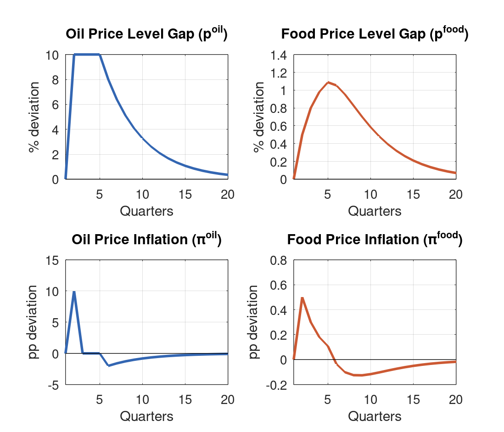
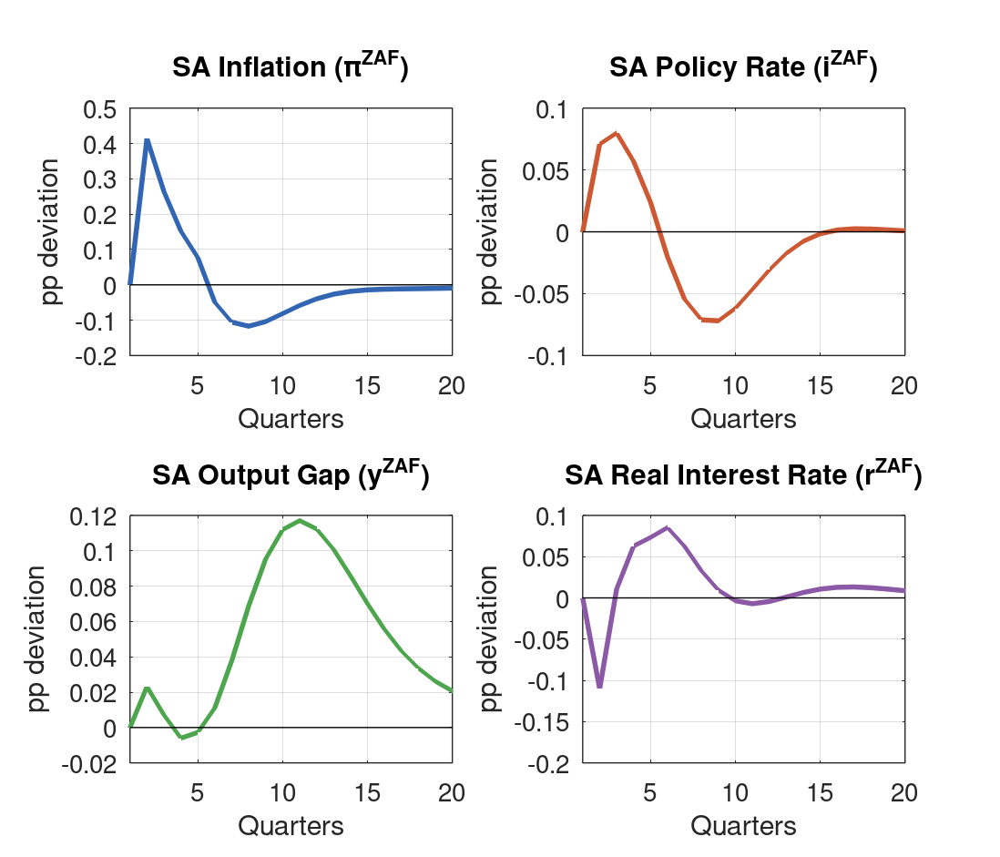
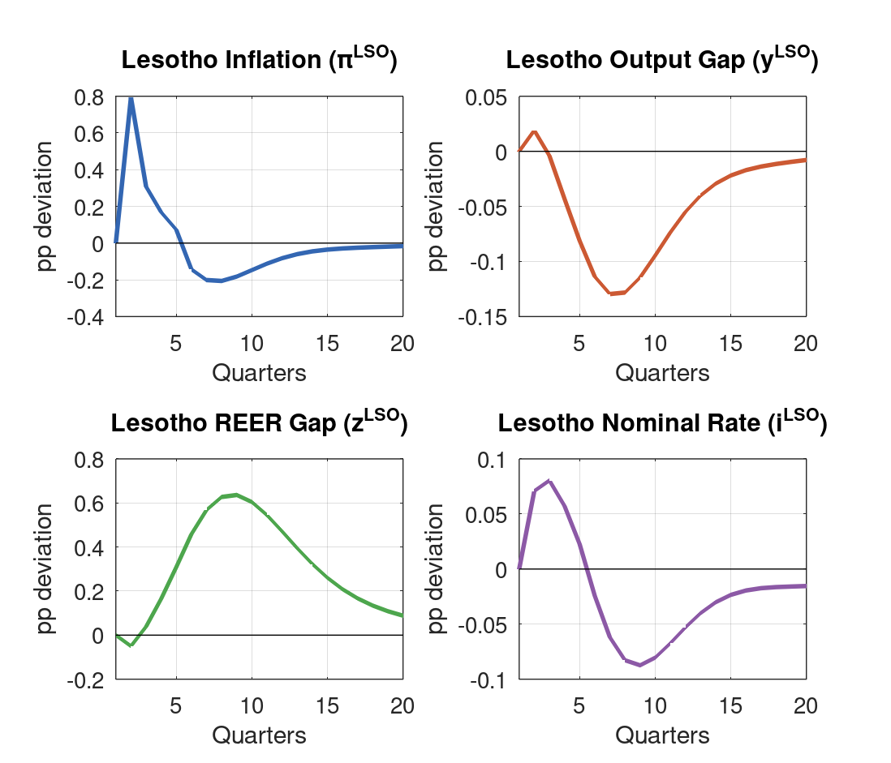
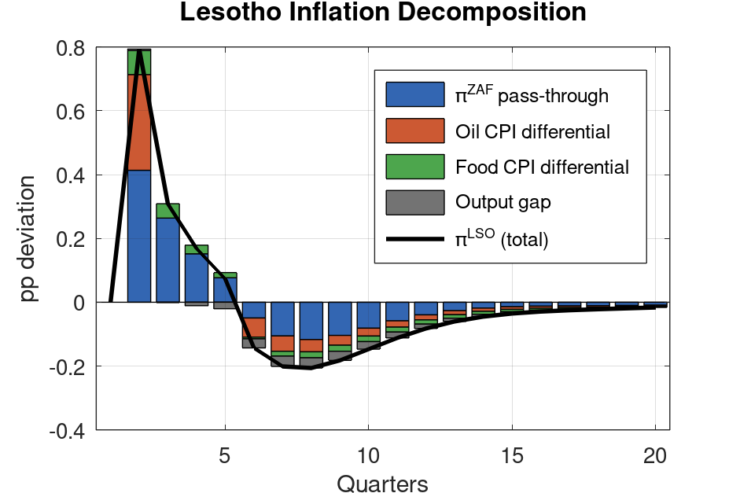

\

**Model:** `lesotho_model_v4.mod` (BOP-based reserves, enriched oil/food transmission, recalibrated 2026-03-08) \
**Simulation:** `simul_oil_q2_sustained.mod` — unanticipated 10% oil price increase, sustained Q2--Q5, superposition method

# Executive Summary {.unnumbered}

This report examines the macroeconomic impact of a 10% sustained oil price increase beginning in Q2, held for four quarters and then allowed to mean-revert. The shock is unanticipated: agents are surprised each quarter. Q1 is clean (no shock), with the full impulse hitting in Q2. This report places primary emphasis on South Africa results, which are intended for review by the South Africa team.

Key findings:

- **SA inflation peaks at +1.07pp in Q2**, driven by the direct oil pass-through ($\lambda_4 = 0.08 \times 10\text{pp} = 0.80\text{pp}$) plus a food inflation contribution (+0.05pp) and Phillips curve amplification. Inflation remains positive through Q5, then undershoots from Q6 as oil prices revert.
- **The SARB tightens by approximately 20bp** (peak +0.196pp at Q3). The response is moderate because agents expect the inflation spike to be transient — each quarter they are surprised anew, so the SARB's forward-looking rule sees limited expected inflation persistence.
- **SA output is mildly positive on impact** (+0.059pp at Q2) because the real rate falls sharply (−0.276pp) as the SARB's nominal rate response lags the inflation spike. Output turns briefly negative in Q4 (−0.012pp) as real rates normalise, then recovers into Q8 as below-baseline inflation reduces real rates.
- **SA REER appreciates slightly in Q2--Q3** (z_zaf = −0.138pp) as rate differentials attract capital, then depreciates from Q4 as the inflation differential reverses.
- Lesotho inherits the SA shock with amplification via CPI weight differentials: **Lesotho inflation peaks at +1.46pp** (vs SA +1.07pp), with the additional 0.39pp attributable to Lesotho's larger oil and food CPI weights.

| Variable | Q2 | Q3 | Q4 | Q5 | Peak | Peak quarter |
|:---------|:---:|:---:|:---:|:---:|:---:|:---:|
| SA inflation ($\pi^{ZAF}$, pp) | +1.07 | +0.67 | +0.38 | +0.18 | +1.07 | Q2 |
| SA policy rate ($i^{ZAF}$, pp) | +0.18 | +0.20 | +0.13 | +0.05 | +0.20 | Q3 |
| SA output gap ($\hat{y}^{ZAF}$, pp) | +0.06 | +0.02 | −0.01 | −0.00 | +0.06 | Q2 |
| SA real rate ($r^{ZAF}$, pp) | −0.28 | +0.03 | +0.16 | +0.19 | +0.22 | Q6 |
| LSO inflation ($\pi^{LSO}$, pp) | +1.46 | +0.71 | +0.37 | +0.14 | +1.46 | Q2 |

: Key impact responses (Q1 = 0 by construction; shock starts Q2) {#tbl-summary}

# Shock Design

## Oil and Food Price Specification

The V4 model specifies oil and food prices as AR(1) processes on the **price level gap** (log deviation from trend), with inflation as the first difference:

$$
p^{oil}_t = \rho_{oil} \, p^{oil}_{t-1} + \varepsilon^{oil}_t, \qquad \pi^{oil}_t = p^{oil}_t - p^{oil}_{t-1}
$$

$$
p^{food}_t = \rho_{food} \, p^{food}_{t-1} + \kappa_{oil \to food} \, p^{oil}_t + \varepsilon^{food}_t, \qquad \pi^{food}_t = p^{food}_t - p^{food}_{t-1}
$$

with $\rho_{oil} = 0.80$ and $\rho_{food} = 0.60$.

## Shock Sequence

To hold oil prices 10% above trend from Q2 through Q5, the innovation sequence is:

$$
\varepsilon^{oil} = \{0,\ 0.10,\ 0.02,\ 0.02,\ 0.02,\ 0,\ 0, \ldots\}
$$

The follow-up shocks of 0.02 offset the AR(1) decay: $0.10 \times (1 - 0.80) = 0.02$. Oil prices then revert naturally from Q6 at rate $\rho_{oil} = 0.80$. For unanticipated shocks, this path is constructed via superposition of shifted base IRFs from `stoch_simul`.

| Quarter | Oil level $p^{oil}$ (%) | Oil inflation $\pi^{oil}$ (pp) | Food level $p^{food}$ (%) | Food inflation $\pi^{food}$ (pp) |
|:-------:|:---:|:---:|:---:|:---:|
| Q1 | 0 | 0 | 0 | 0 |
| Q2 | +10.0 | +10.0 | +0.50 | +0.50 |
| Q3 | +10.0 | 0 | +0.80 | +0.30 |
| Q4 | +10.0 | 0 | +0.98 | +0.18 |
| Q5 | +10.0 | 0 | +1.09 | +0.11 |
| Q6 | +8.0 | −2.0 | +1.05 | −0.04 |
| Q8 | +5.1 | −1.3 | +0.83 | −0.13 |
| Q12 | +2.1 | −0.5 | +0.39 | −0.09 |

: Commodity price paths {#tbl-shock}

Note that oil inflation is a one-quarter spike at Q2 only. During Q3--Q5, the oil **level** is elevated but oil **inflation** is zero. The food price level accumulates slowly throughout the sustained phase, providing a continued modest inflation impulse via $\pi^{food}$.

{#fig-prices width=90%}

# Transmission Channels

## Channel 1: Oil → SA Inflation (Direct)

Oil price inflation enters the SA hybrid Phillips curve:

$$
\pi^{ZAF}_t = \lambda_1 \pi^{ZAF}_{t-1} + (1-\lambda_1) E_t \pi^{ZAF}_{t+1} + \lambda_2 \hat{y}^{ZAF}_t + \lambda_3 \Delta z^{ZAF}_t + \lambda_4 \pi^{oil}_t + \lambda_5 \pi^{food}_t + \varepsilon^{\pi,ZAF}_t
$$

With $\lambda_4 = 0.08$, the +10pp oil inflation spike in Q2 contributes $0.08 \times 10 = 0.80$pp directly. This is the dominant driver of the Q2 inflation peak. In Q3--Q5, $\pi^{oil} = 0$ so no new direct impulse enters, but backward-looking persistence ($\lambda_1 = 0.50$) sustains positive SA inflation.

The recalibrated $\lambda_4 = 0.08$ (up from 0.03 in early V4) reflects the lower bound of Ndou et al. (2017) empirical estimates. The Q2 direct contribution of 0.80pp is the core of the inflation response.

## Channel 2: Oil → Food Prices → SA Inflation

The food price level responds to the oil price level via $\kappa_{oil \to food} = 0.05$:

$$
p^{food}_t = 0.60 \cdot p^{food}_{t-1} + 0.05 \cdot p^{oil}_t + \varepsilon^{food}_t
$$

With oil at +10%, this raises the food level by 0.50% in Q2, accumulating to 1.09% by Q5. Food inflation ($\pi^{food}$) feeds into SA inflation via $\lambda_5 = 0.10$:

- Q2 contribution: $0.10 \times 0.50 = 0.05$pp
- Q3: $0.10 \times 0.30 = 0.03$pp
- Q4--Q5: smaller, declining

The food channel provides a secondary, slower-moving inflation impulse that sustains positive SA inflation through Q5.

## Channel 3: SARB Monetary Policy Response

The SARB Taylor rule:

$$
i^{ZAF}_t = 0.75 \cdot i^{ZAF}_{t-1} + 0.25 \cdot (1.50 \cdot E_t[\pi^{ZAF}_{t+1}] + 0.50 \cdot \hat{y}^{ZAF}_t)
$$

Under unanticipated shocks, each quarter's shock surprises agents. In Q2, they observe higher inflation but expect immediate reversion. $E_2[\pi^{ZAF}_3]$ is relatively modest, so the SARB's forward-looking rule responds conservatively: +0.178pp (roughly 18bp) at Q2, peaking at +0.196pp (20bp) at Q3. By Q5, the rate is nearly back to baseline (+0.048pp). This is a **moderate tightening** — the SARB effectively "looks through" much of the spike, consistent with the transient nature of a one-time inflation surprise.

## Channel 4: SA Real Interest Rate and Output

The SA real rate is $r^{ZAF}_t = i^{ZAF}_t - E_t[\pi^{ZAF}_{t+1}]$. On impact (Q2), the large inflation spike means expected next-period inflation is elevated (agents see current SA inflation at +1.07pp), so the real rate **falls** to −0.276pp despite the nominal rate rising. This provides a brief demand stimulus, explaining why SA output is mildly positive (+0.059pp) in Q2.

From Q3, as inflation declines, the real rate normalises and turns positive, generating a mild output drag through Q4--Q5. By Q6, below-baseline inflation reduces real rates again, and SA output recovers.

# Simulation Results: South Africa

## Full Results Table

| Quarter | $\pi^{ZAF}$ | $\hat{y}^{ZAF}$ | $i^{ZAF}$ | $r^{ZAF}$ | $z^{ZAF}$ |
|:-------:|:-----------:|:----------------:|:---------:|:---------:|:---------:|
| Q1 | 0.000 | 0.000 | 0.000 | 0.000 | 0.000 |
| Q2 | +1.074 | +0.059 | +0.178 | −0.276 | −0.138 |
| Q3 | +0.669 | +0.019 | +0.196 | +0.035 | −0.032 |
| Q4 | +0.375 | −0.012 | +0.133 | +0.165 | +0.251 |
| Q5 | +0.183 | −0.000 | +0.048 | +0.188 | +0.617 |
| Q6 | −0.140 | +0.038 | −0.064 | +0.215 | +1.015 |
| Q8 | −0.302 | +0.187 | −0.187 | +0.078 | +1.525 |
| Q12 | −0.098 | +0.288 | −0.076 | −0.011 | +1.167 |
| Q16 | −0.031 | +0.140 | +0.005 | +0.034 | +0.499 |

: South Africa impulse responses (pp deviation from steady state) {#tbl-zaf}

{#fig-sa width=90%}

## SA Inflation

SA inflation peaks at **+1.074pp in Q2**, declining monotonically through Q5 (+0.183pp), and turning negative from Q6 (−0.140pp) as oil prices revert below trend. The undershoot bottoms at approximately −0.302pp at Q8.

Decomposing the Q2 peak:

| Component | Contribution (pp) |
|:----------|:-----------------:|
| Direct oil ($\lambda_4 \times \pi^{oil}$): $0.08 \times 10$ | +0.800 |
| Direct food ($\lambda_5 \times \pi^{food}$): $0.10 \times 0.50$ | +0.050 |
| REER change ($\lambda_3 \times \Delta z^{ZAF}$): $0.15 \times (-0.138)$ | −0.021 |
| Phillips curve forward/backward amplification | +0.245 |
| **Total SA inflation** | **+1.074** |

: Decomposition of SA inflation at Q2 {#tbl-decomp-zaf}

The undershoot from Q6 is a mechanical consequence of the level-based AR(1) specification: once the oil price level starts reverting, $\pi^{oil}$ turns negative, pulling SA inflation below baseline.

## SARB Policy Rate

The SARB raises rates by 18bp at Q2, peaking at 20bp (Q3), then reverting. This is a **modest tightening**, consistent with the transient nature of an unanticipated shock — the forward-looking Taylor rule sees limited expected inflation because agents forecast reversion immediately. By Q5, the rate is near zero (+0.048pp); by Q6 the SARB is easing (−0.064pp) as below-baseline inflation emerges.

## SA Output Gap

SA output follows a clear two-phase pattern:

1. **Q2--Q3 (mildly positive):** The real rate falls sharply on impact (nominal rate rises less than current inflation), providing a brief demand stimulus. SA output is +0.059pp at Q2.
2. **Q4--Q5 (slightly negative):** Real rates normalise and turn positive, generating a mild drag. The effect is tiny (−0.012pp at Q4) and barely distinguishable from baseline.
3. **Q6--Q12 (recovery):** Below-baseline inflation reduces real rates, and SA output recovers, reaching +0.288pp at Q12. This medium-term recovery is driven by the prolonged disinflationary phase as oil prices revert.

## SA REER

The SA REER gap ($z^{ZAF}$) shows a sign reversal: slight appreciation at Q2 (−0.138pp, consistent with a positive interest rate differential attracting capital), then depreciation from Q4 as the inflation reversal sets in. The REER depreciates substantially by Q8 (+1.525pp), reflecting cumulative disinflationary pressures once oil prices revert. This depreciation is the main medium-term demand stimulus supporting the output recovery at Q8--Q12.

## Assessment for SA Smell Test

The SA results are qualitatively consistent with expectations:

1. **Inflation magnitude (+1.07pp peak):** Plausible given the direct oil pass-through ($\lambda_4 = 0.08$) and the size of the shock (10pp of oil inflation). Empirical SA studies (Ndou et al., 2017) find pass-through of 0.07--0.14 per pp of oil inflation; this model sits at the lower bound.
2. **SARB response (~20bp):** Conservative but defensible for an unanticipated transient shock. The SARB has historically responded cautiously to oil price spikes judged to be supply-driven.
3. **Output dynamics:** The brief positive output response on impact (real rate falls) followed by mild contraction is a well-known feature of oil shocks under imperfect information — it mirrors the "news shock" literature.
4. **Inflation undershoot from Q6:** Mechanical but realistic — as oil prices revert, headline inflation drops below trend. The undershoot magnitude (−0.302pp at Q8) is consistent with empirical post-oil-shock dynamics.
5. **REER depreciation at medium horizon:** Consistent with SA's terms-of-trade exposure — net oil importer, so sustained oil prices compress the current account and weaken the rand.

# Simulation Results: Lesotho

## Full Results Table

| Quarter | $\pi^{LSO}$ | $\hat{y}^{LSO}$ | $i^{LSO}$ | $r^{LSO}$ | $z^{LSO}$ |
|:-------:|:-----------:|:----------------:|:---------:|:---------:|:---------:|
| Q1 | 0.000 | 0.000 | 0.000 | 0.000 | 0.000 |
| Q2 | +1.458 | +0.034 | +0.178 | −0.237 | +0.035 |
| Q3 | +0.707 | −0.029 | +0.196 | +0.117 | +0.264 |
| Q4 | +0.371 | −0.127 | +0.133 | +0.280 | +0.582 |
| Q5 | +0.145 | −0.219 | +0.043 | +0.321 | +0.938 |
| Q6 | −0.278 | −0.292 | −0.076 | +0.346 | +1.271 |
| Q8 | −0.437 | −0.310 | −0.218 | +0.164 | +1.620 |
| Q12 | −0.155 | −0.114 | −0.130 | −0.022 | +1.145 |
| Q16 | −0.050 | −0.026 | −0.045 | −0.001 | +0.480 |

: Lesotho impulse responses (pp deviation from steady state) {#tbl-lso}

{#fig-lesotho width=90%}

## Inflation Dynamics

Lesotho inflation exceeds SA inflation throughout by approximately 0.38pp (Q2). This differential is driven by CPI weight differentials:

$$
\pi^{LSO}_t = \pi^{ZAF}_t + (\omega^{LSO}_1 - \omega^{ZAF}_1)\pi^{oil}_t + (\omega^{LSO}_2 - \omega^{ZAF}_2)\pi^{food}_t + \beta_1 \hat{y}^{LSO}_t
$$

At Q2, the additional inflation relative to SA:

- Oil CPI differential: $(0.08 - 0.05) \times 10 = 0.30$pp
- Food CPI differential: $(0.35 - 0.20) \times 0.50 = 0.075$pp
- Output gap contribution: $0.25 \times 0.034 \approx 0.01$pp

Total differential: approximately **+0.39pp** above SA, consistent with the observed gap of $1.458 - 1.074 = 0.384$pp.

{#fig-decomp width=85%}

## Output Gap

The Lesotho output gap is initially mildly positive (+0.034pp at Q2) — the falling real rate provides brief stimulus — but contracts persistently from Q3. Output troughs at −0.310pp (Q8). Unlike SA, the Lesotho output contraction is deeper and more prolonged because: (i) the Lesotho real rate rises faster (larger inflation spike means faster reversion and steeper real rate trajectory), and (ii) no equivalent terms-of-trade depreciation stimulus operates in the short run.

## Reserves

Reserves are essentially unaffected in the short run (Q2--Q4 deviation near zero). From Q5, reserves improve marginally as lower output reduces import demand. This confirms that oil price shocks operate through price and interest rate channels in this model, not the balance of payments directly.

# Policy Implications

1. **Transient but material inflation spike.** A 10% oil price increase sustained for four quarters raises SA inflation by approximately 1pp and Lesotho inflation by 1.5pp at peak. Both revert within 4--5 quarters, so fiscal or monetary interventions targeting only the peak will be poorly timed.

2. **SARB response limited under unanticipated shocks.** The SARB tightens by only ~20bp because agents expect each quarterly price increase to be the last. If oil market developments (e.g. geopolitical disruption, OPEC cut) were announced and agents revised their priors about persistence, the SARB would tighten more aggressively — with important implications for Lesotho under the peg.

3. **Lesotho's CPI amplification.** Lesotho's larger food and oil CPI weights (food 35% vs SA 20%) amplify both the inflationary and disinflationary phases. The policymaker cannot offset this differential under the peg — it is structural. The Lesotho real rate trajectory is therefore more volatile than SA's.

4. **Medium-term output recovery.** The disinflationary undershoot from Q6 reduces SA real rates and depreciates the REER, generating a meaningful output recovery by Q8--Q12 (+0.288pp SA, improving Lesotho conditions via the $\alpha_3 = 0.30$ spillover). This partial self-correction limits the case for large countercyclical fiscal responses.

5. **Reserve adequacy unaffected.** The peak reserve deviation is less than 0.02pp through Q5. Oil price shocks do not threaten the reserve position under V4 calibration.

# Technical Notes

## Model Version

Lesotho QPM V4 (recalibrated 2026-03-08). Key parameters relevant to this simulation:

| Parameter | Value | Description |
|:----------|:-----:|:------------|
| $\lambda_4$ | 0.08 | Oil inflation pass-through to SA CPI |
| $\lambda_5$ | 0.10 | Food inflation pass-through to SA CPI |
| $\kappa_{oil \to food}$ | 0.05 | Oil level → food price level |
| $\rho_{oil}$ | 0.80 | Oil price persistence (half-life ~3.1Q) |
| $\rho_{food}$ | 0.60 | Food price persistence (half-life ~1.4Q) |
| $\omega^{LSO}_1 - \omega^{ZAF}_1$ | 0.03 | Oil CPI weight differential |
| $\omega^{LSO}_2 - \omega^{ZAF}_2$ | 0.15 | Food CPI weight differential |
| $\phi_\pi$ | 1.50 | SARB inflation response coefficient |
| $\phi_i$ | 0.75 | SARB interest rate smoothing |
| $\lambda_1$ | 0.50 | SA Phillips curve backward-looking weight |
| $\alpha_3$ | 0.30 | Lesotho output spillover from SA |

: Key parameters {#tbl-params}

## Solution Method

**Unanticipated shocks** are implemented via Dynare's `stoch_simul(order=1, irf=20)`, which generates the impulse response function to a single standard deviation shock (`stderr 0.10`). The sustained Q2-start path is constructed by superimposing four shifted copies of the base IRF, weighted by the eps sequence $\{1.0, 0.2, 0.2, 0.2\}$ (relative to base of 0.10) applied at periods $\{2, 3, 4, 5\}$. This is valid because the model is linear.

Blanchard-Kahn conditions satisfied: 5 eigenvalues larger than 1 in modulus for 5 forward-looking variables.

## Limitations

- **Unanticipated only.** This simulation assumes full surprise each quarter. If oil price persistence were partially anticipated (e.g. following an OPEC announcement), SA inflation would be higher on impact and the SARB would respond more aggressively. See `analysis/oil_shock_report.qmd` for a comparison with the anticipated case.
- **Linear model.** Symmetric responses assumed. Large oil shocks may produce non-linear fiscal or financial adjustments.
- **No fiscal response.** Government spending is held constant throughout.
- **Reduced-form pass-through.** $\lambda_4$, $\lambda_5$, and $\kappa_{oil \to food}$ are calibrated approximations; structural heterogeneity in oil sensitivity across sectors is not captured.
