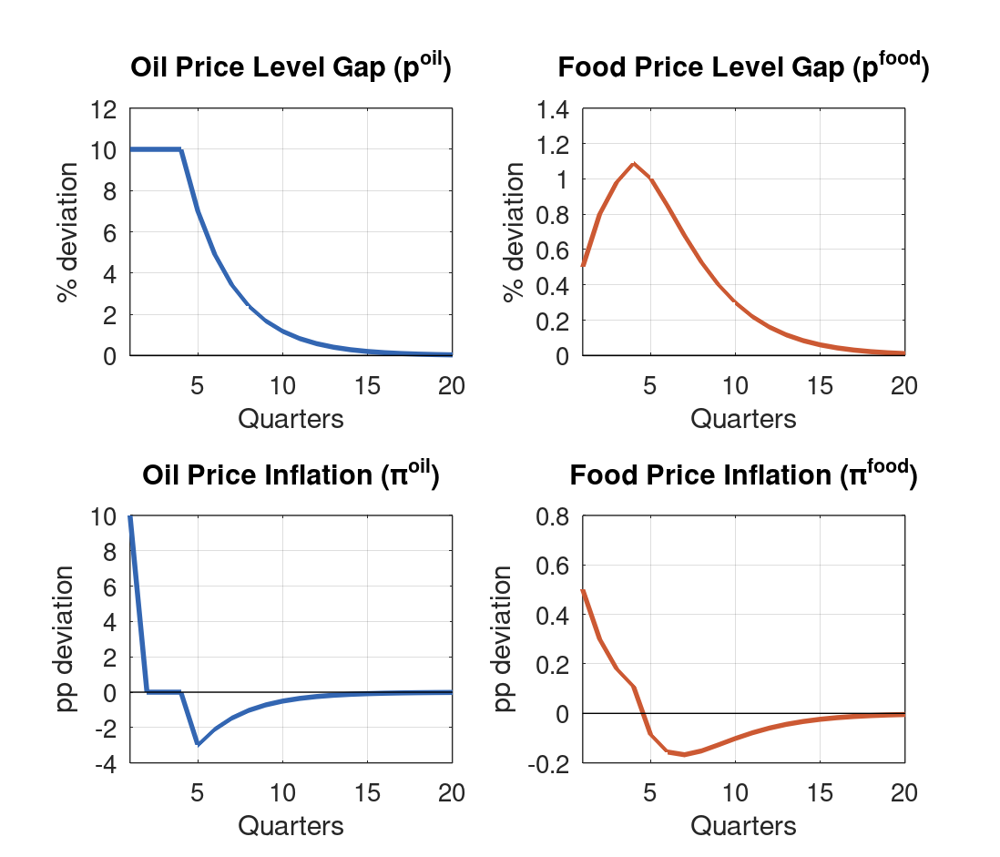
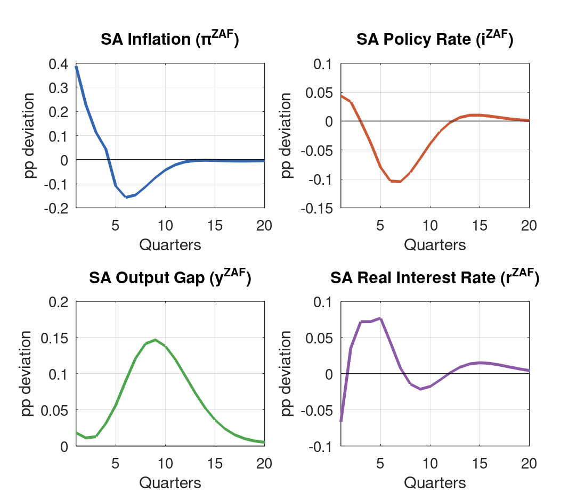
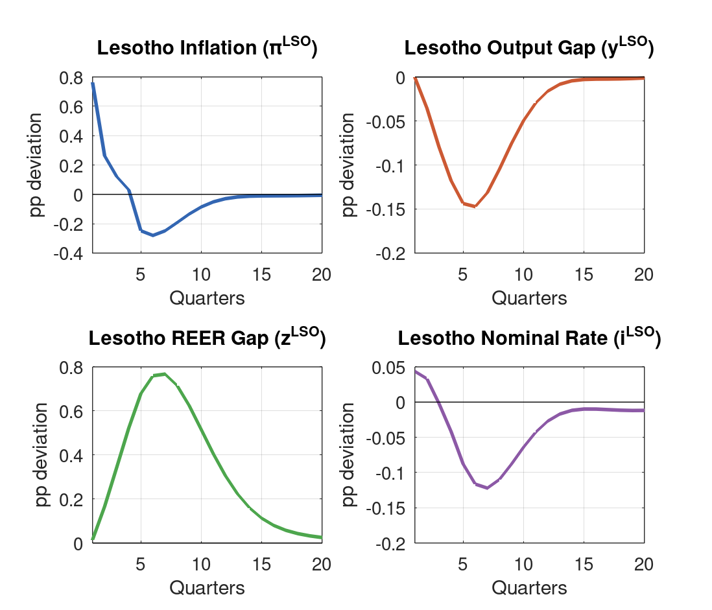
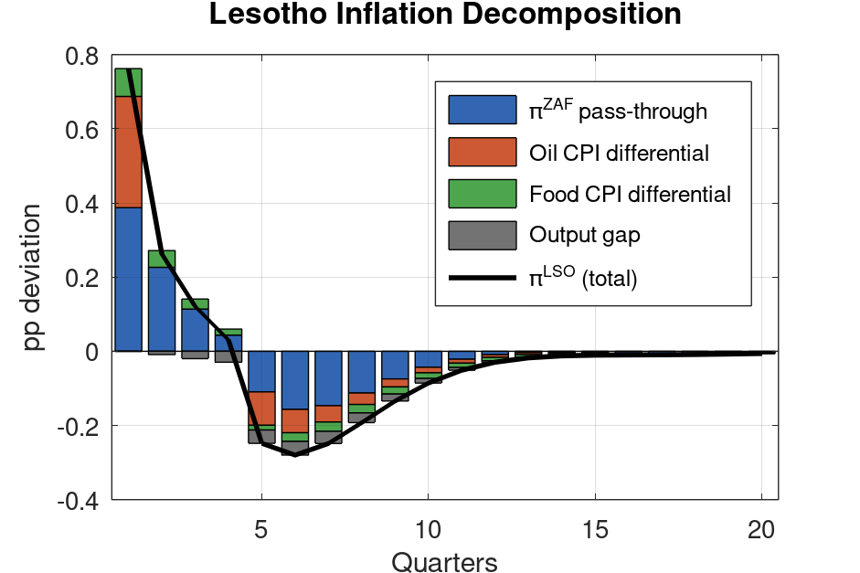
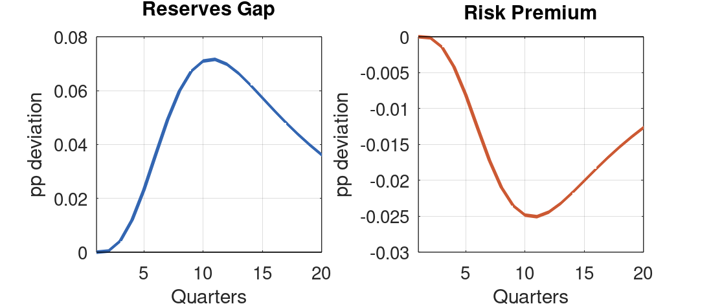

\

**Model:** `lesotho_model_v4.mod` (BOP-based reserves with enriched oil/food transmission) \
**Simulation:** Sustained 10% oil price increase for 4 quarters, comparing unanticipated and anticipated shocks

# Executive Summary {.unnumbered}

This report examines the macroeconomic impact of a sustained 10 percent oil price increase on South Africa and Lesotho using Version 4 of the Lesotho Quarterly Projection Model (QPM). Oil prices are held 10% above trend for four quarters, then allowed to mean-revert. We compare two expectation regimes: **unanticipated shocks** (agents are surprised each quarter) and **anticipated shocks** (agents know the full path from the start).

The expectation regime fundamentally changes the nature of the shock's impact on Lesotho:

- **Unanticipated:** The Lesotho real interest rate **rises** on impact (agents expect inflation to collapse next quarter), making the shock **contractionary**. Output falls and the REER depreciates.
- **Anticipated:** The Lesotho real interest rate **falls** on impact (agents know inflation will persist), making the shock **expansionary**. Output rises and the REER appreciates.

This difference is driven entirely by the expected inflation channel ($E_t[\pi_{t+1}]$) in the Fisher equation. Under the peg, the nominal rate is determined by the SARB, so the real rate depends on whether agents expect inflation to continue.

| Variable | Unanticipated | Anticipated |
|:---------|:---:|:---:|
| Lesotho inflation (Q1) | +0.76pp | +0.90pp |
| Lesotho output gap (Q1) | -0.00pp | +0.06pp |
| Lesotho real rate (Q1) | +0.01pp | **-0.29pp** |
| SARB policy rate (Q1) | +0.04bp | +0.15bp |
| Lesotho REER (peak) | +0.77pp (depreciation) | +0.72pp (depreciation) |

: Comparison of key impact responses {#tbl-summary}

# Shock Design

## Oil and Food Price Specification

Oil and food prices follow AR(1) processes on the **price level gap** (log deviation from trend), with inflation defined as the first difference:

$$
p^{oil}_t = \rho_{oil} \, p^{oil}_{t-1} + \varepsilon^{oil}_t, \qquad \pi^{oil}_t = p^{oil}_t - p^{oil}_{t-1}
$$

$$
p^{food}_t = \rho_{food} \, p^{food}_{t-1} + \kappa_{oil \to food} \, p^{oil}_t + \varepsilon^{food}_t, \qquad \pi^{food}_t = p^{food}_t - p^{food}_{t-1}
$$

This ensures that a one-time price shock produces a transient inflation spike followed by reversal as prices revert to trend, consistent with the standard QPM treatment.

## Shock Sequence

To hold oil prices 10% above trend for four quarters requires a sequence of innovations: $\varepsilon^{oil} = \{0.10, 0.03, 0.03, 0.03\}$ (the follow-up shocks offset the AR(1) decay of $\rho_{oil} = 0.70$). Oil prices then revert naturally from Q5. Oil inflation is positive only on impact (Q1), zero during the price plateau (Q2--Q4), then negative as prices revert.

| Quarter | Oil price level | Oil inflation | Food price level | Food inflation |
|:-------:|:---:|:---:|:---:|:---:|
| | $p^{oil}$ (%) | $\pi^{oil}$ (pp) | $p^{food}$ (%) | $\pi^{food}$ (pp) |
| Q1 | +10.0 | +10.0 | +0.50 | +0.50 |
| Q2 | +10.0 | 0.0 | +0.80 | +0.30 |
| Q3 | +10.0 | 0.0 | +0.98 | +0.18 |
| Q4 | +10.0 | 0.0 | +1.09 | +0.11 |
| Q5 | +7.0 | -3.0 | +1.00 | -0.09 |
| Q6 | +4.9 | -2.1 | +0.85 | -0.16 |
| Q8 | +2.4 | -1.0 | +0.53 | -0.15 |
| Q12 | +0.6 | -0.3 | +0.16 | -0.06 |

: Oil and food price paths (identical under both expectation regimes) {#tbl-shock}

The oil and food price paths are **identical** under both scenarios---the shock sequence is the same. The entire difference in macroeconomic outcomes comes from how forward-looking variables (expected inflation, exchange rates, policy rates) respond.

{#fig-prices width=90%}

## Expectation Regimes

**Unanticipated shocks.** Each quarterly innovation surprises agents. At Q1, agents observe the oil price jump but expect no further shocks---they forecast oil prices to revert immediately. When oil prices remain elevated in Q2, they are surprised again. This is modeled by superimposing the impulse response functions from a first-order stochastic simulation (`stoch_simul`), which is valid because the model is linear.

**Anticipated shocks.** Agents know at $t=0$ that oil prices will remain elevated for four quarters. Forward-looking variables (expected inflation, exchange rates) incorporate this information immediately. This is modeled using Dynare's perfect foresight solver.

# Transmission Channels

## Channel 1: Oil to SA Inflation (Direct)

Oil price inflation enters the SA hybrid Phillips curve:

$$
\pi^{ZAF}_t = \lambda_1 \pi^{ZAF}_{t-1} + (1-\lambda_1) E_t \pi^{ZAF}_{t+1} + \lambda_2 \hat{y}^{ZAF}_t + \lambda_3 \Delta z^{ZAF}_t + \lambda_4 \pi^{oil}_t + \lambda_5 \pi^{food}_t + \varepsilon^{\pi,ZAF}_t
$$

With $\lambda_4 = 0.03$, the +10pp oil inflation on impact adds 0.30pp directly. Under anticipated shocks, the forward-looking component ($E_t[\pi^{ZAF}_{t+1}]$) is higher because agents know food inflation will persist---this raises SA inflation by an additional 0.12pp in Q1. During Q2--Q4, $\pi^{oil} = 0$ so no new direct oil impulse enters, but food inflation and Phillips curve persistence sustain positive SA inflation. Under unanticipated shocks, these persistence effects are weaker because agents continually expect inflation to fall.

## Channel 2: Oil to Food Prices

The food price level responds to the oil price level:

$$
p^{food}_t = \rho_{food} \, p^{food}_{t-1} + \kappa_{oil \to food} \, p^{oil}_t + \varepsilon^{food}_t
$$

With $\kappa_{oil \to food} = 0.05$ and oil prices sustained at +10%, the food price level accumulates to +1.09% by Q4. This provides the only sustained inflationary impulse during Q2--Q4 (when oil inflation is zero). Food prices are exogenous, so this channel is **identical** under both expectation regimes.

## Channel 3: The Real Interest Rate — Where Anticipation Matters

The Lesotho real interest rate is the pivotal variable:

$$
r^{LSO}_t = i^{LSO}_t - E_t[\pi^{LSO}_{t+1}]
$$

Under the peg, $i^{LSO} = i^{ZAF} + \text{prem}$, so the nominal rate is determined by the SARB. The real rate therefore depends on **expected inflation**.

**Anticipated:** At Q1, agents know inflation will remain elevated through Q4 (driven by continued food inflation and Phillips curve persistence). $E_1[\pi^{LSO}_2]$ is high, so the real rate **falls** to $-0.29$pp. This stimulates demand through the IS curve.

**Unanticipated:** At Q1, agents expect no further shocks. They forecast oil prices to start reverting immediately, so $E_1[\pi^{LSO}_2]$ is near zero. The real rate stays near baseline (+0.01pp) or even rises slightly. No demand stimulus.

This difference propagates through the entire economy: expansionary output gap under anticipated shocks, contractionary under unanticipated.

## Channel 4: SARB Monetary Policy

The SARB's forward-looking Taylor rule responds to expected inflation:

$$
i^{ZAF}_t = \phi_i \, i^{ZAF}_{t-1} + (1 - \phi_i)(\phi_\pi \, E_t[\pi^{ZAF}_{t+1}] + \phi_y \, \hat{y}^{ZAF}_t)
$$

**Anticipated:** The SARB tightens preemptively (+15bp Q1, +21bp Q2, +18bp Q3), because forward-looking inflation expectations embed the sustained shock. This creates a stronger monetary transmission to SA output.

**Unanticipated:** The SARB barely responds (+4bp Q1, +3bp Q2), because expected inflation drops quickly each quarter. By Q3, the SARB is already easing.

# Simulation Results: South Africa

| | Anticipated | | | | Unanticipated | | | |
|:---:|:---:|:---:|:---:|:---:|:---:|:---:|:---:|:---:|
| **Qtr** | $\pi^{ZAF}$ | $\hat{y}^{ZAF}$ | $i^{ZAF}$ | $r^{ZAF}$ | $\pi^{ZAF}$ | $\hat{y}^{ZAF}$ | $i^{ZAF}$ | $r^{ZAF}$ |
| Q1 | +0.51 | +0.05 | +0.15 | -0.24 | +0.39 | +0.02 | +0.04 | -0.07 |
| Q2 | +0.39 | +0.01 | +0.21 | -0.04 | +0.23 | +0.01 | +0.03 | +0.04 |
| Q3 | +0.24 | -0.04 | +0.18 | +0.11 | +0.11 | +0.01 | -0.00 | +0.07 |
| Q4 | +0.07 | -0.07 | +0.07 | +0.21 | +0.04 | +0.03 | -0.04 | +0.07 |
| Q5 | -0.14 | -0.05 | -0.03 | +0.18 | -0.11 | +0.06 | -0.08 | +0.08 |
| Q6 | -0.21 | -0.00 | -0.10 | +0.10 | -0.16 | +0.09 | -0.10 | +0.04 |
| Q8 | -0.15 | +0.11 | -0.12 | -0.02 | -0.11 | +0.14 | -0.09 | -0.01 |
| Q12 | -0.01 | +0.11 | -0.01 | -0.01 | -0.01 | +0.10 | -0.00 | +0.00 |

: South Africa impulse responses (pp, deviation from steady state) {#tbl-zaf}

{#fig-sa width=90%}

Under **anticipated** shocks, SA inflation peaks higher (+0.51pp Q1 vs +0.39pp) because the forward-looking Phillips curve component embeds knowledge of sustained price pressure. The SARB tightens more aggressively, pushing SA output into contraction earlier (Q3 vs Q5). Under **unanticipated** shocks, SA inflation peaks lower and the SARB barely reacts, so SA output actually expands modestly in the medium term as below-baseline inflation reduces real rates.

Both scenarios converge by Q8--Q12 as the oil shock dissipates.

# Simulation Results: Lesotho

| | Anticipated | | | | Unanticipated | | | |
|:---:|:---:|:---:|:---:|:---:|:---:|:---:|:---:|:---:|
| **Qtr** | $\pi^{LSO}$ | $\hat{y}^{LSO}$ | $r^{LSO}$ | $z^{LSO}$ | $\pi^{LSO}$ | $\hat{y}^{LSO}$ | $r^{LSO}$ | $z^{LSO}$ |
| Q1 | +0.90 | +0.06 | **-0.29** | -0.15 | +0.76 | -0.00 | **+0.01** | +0.02 |
| Q2 | +0.45 | +0.05 | -0.06 | -0.11 | +0.26 | -0.04 | +0.14 | +0.17 |
| Q3 | +0.27 | -0.01 | +0.12 | +0.03 | +0.12 | -0.08 | +0.20 | +0.34 |
| Q4 | +0.06 | -0.10 | +0.36 | +0.24 | +0.03 | -0.12 | +0.21 | +0.52 |
| Q5 | -0.29 | -0.16 | +0.31 | +0.48 | -0.25 | -0.14 | +0.19 | +0.68 |
| Q6 | -0.34 | -0.18 | +0.21 | +0.64 | -0.28 | -0.15 | +0.13 | +0.76 |
| Q8 | -0.24 | -0.14 | +0.03 | +0.72 | -0.19 | -0.11 | +0.02 | +0.72 |
| Q12 | -0.03 | -0.02 | -0.02 | +0.33 | -0.03 | -0.02 | -0.01 | +0.31 |

: Lesotho impulse responses (pp, deviation from steady state) {#tbl-lso}

{#fig-lesotho width=90%}

## The Real Interest Rate: Pivotal Difference

The most striking result is the **sign reversal** of the Lesotho real rate on impact:

- **Anticipated** ($r^{LSO}_1 = -0.29$pp): Agents know inflation will persist, so $E_1[\pi^{LSO}_2] = +0.45$pp is high. With $i^{LSO}_1 = +0.15$pp, the real rate falls sharply. This stimulates demand---the output gap expands to +0.06pp.

- **Unanticipated** ($r^{LSO}_1 = +0.01$pp): Agents expect oil prices to start reverting, so $E_1[\pi^{LSO}_2]$ is near zero. With $i^{LSO}_1 = +0.04$pp, the real rate stays flat. No demand stimulus---output is essentially unchanged on impact, then contracts.

Under the peg, the real interest rate channel is the dominant transmission mechanism from inflation to output. The anticipation assumption therefore determines whether an oil shock is expansionary or contractionary for Lesotho in the short run.

## Inflation Dynamics

Lesotho inflation is higher under anticipated shocks (+0.90pp vs +0.76pp on impact) for two reasons:

1. **Higher SA inflation pass-through** (+0.51pp vs +0.39pp): the forward-looking component of the SA Phillips curve ($(1-\lambda_1) E_t[\pi^{ZAF}_{t+1}]$) is elevated because agents know food inflation will persist through Q4, which feeds back into current SA inflation. The SARB tightens more aggressively in response (+15bp vs +4bp), but this *moderates* rather than causes the higher inflation.
2. **Positive output gap** contributes +0.015pp via $\beta_1 = 0.25$ (vs near-zero contribution under unanticipated), as the falling real rate stimulates demand.

Both scenarios produce a similar inflation profile: positive through Q4, then undershooting from Q5. The undershoot is larger under anticipated shocks ($-0.34$pp vs $-0.28$pp at Q6) because the SARB tightened more during Q1--Q3, creating a more pronounced inflation reversal.

{#fig-decomp width=85%}

## Output Gap

| Quarter | Anticipated | Unanticipated | Difference |
|:-------:|:-----------:|:-------------:|:----------:|
| Q1 | +0.06 | -0.00 | +0.06 |
| Q2 | +0.05 | -0.04 | +0.09 |
| Q3 | -0.01 | -0.08 | +0.07 |
| Q4 | -0.10 | -0.12 | +0.02 |
| Q5 | -0.16 | -0.14 | -0.02 |
| Q6 | -0.18 | -0.15 | -0.04 |

: Lesotho output gap comparison (pp) {#tbl-output}

Under anticipated shocks, output is initially expansionary (Q1--Q2) as the falling real rate stimulates demand. Under unanticipated shocks, output is contractionary from the start. By Q4--Q5, both scenarios converge as the real rate dynamics align. The anticipated scenario then produces a *deeper* contraction in Q5--Q6 because the SARB tightened more during the shock phase.

## Real Exchange Rate

The REER evolves similarly under both scenarios in the medium term, but the early dynamics differ:

- **Anticipated:** REER initially *appreciates* ($-0.15$pp Q1) as agents price in the sustained inflation differential. The appreciation persists through Q2 before reversing.
- **Unanticipated:** REER *depreciates* from Q1, reaching +0.76pp by Q6, as the inflation reversal from Q5 cumulatively favors Lesotho's price competitiveness.

By Q8, both scenarios converge to roughly +0.72pp depreciation. The REER depreciation reflects the fact that Lesotho's cumulative inflation eventually falls below SA's, as the larger CPI weight differentials amplify both the inflationary and disinflationary phases.

## Reserves

{#fig-reserves width=90%}

Reserves are virtually unaffected under both scenarios (peak deviation $< 0.07$pp under unanticipated, $< 0.10$pp under anticipated). Oil price shocks operate through the price and interest rate channels, not the balance of payments.

# Policy Implications

1. **Anticipation changes the policy problem.** If agents anticipate a sustained oil price increase (e.g., due to geopolitical disruption), the falling real rate makes the shock expansionary---output rises and demand pressures compound the inflation spike. If agents are surprised each quarter, the shock is contractionary. The CBL faces a fundamentally different policy environment depending on the credibility and transparency of oil price expectations.

2. **The SARB response matters more under anticipation.** Under anticipated shocks, the SARB tightens preemptively (+15bp Q1 vs +4bp), which moderates the inflation spike and limits the real rate decline. Under unanticipated shocks, the SARB barely reacts---it effectively "looks through" the transient inflation. For Lesotho under the peg, this means the degree of monetary tightening imported depends on market expectations about oil price persistence.

3. **Two-phase inflation dynamics under both regimes.** Regardless of anticipation, Lesotho experiences positive inflation during Q1--Q4 followed by below-baseline inflation from Q5 as oil prices revert. The magnitude differs (anticipated: +0.90 to -0.34pp; unanticipated: +0.76 to -0.28pp) but the qualitative pattern is the same. Fiscal interventions risk being poorly timed if they address only the initial spike.

4. **Competitiveness improves on net under both regimes.** Despite differences in the initial REER response, both scenarios produce real depreciation by Q7--Q8 (improving competitiveness) because the inflation undershoot phase is more prolonged than the initial spike.

5. **Reserve adequacy is unaffected.** Under both scenarios, reserves deviate by less than 0.10pp. Oil shocks operate through price channels, not the balance of payments.

6. **Persistence is the key unknown.** With $\rho_{oil} = 0.70$, oil prices revert within a few quarters of the sustained phase ending. If oil prices were more persistent ($\rho_{oil} \to 0.90$), the reversion phase would be slower, inflation would stay elevated longer, and the dynamics would shift more toward the anticipated-shock pattern even under unanticipated shocks.

# Technical Notes

## Model Specification

Version 4 of the Lesotho QPM features BOP-based reserves and enriched oil/food transmission.

| Parameter | Value | Role |
|-----------|:-----:|------|
| $\lambda_4$ | 0.03 | Oil price inflation pass-through to SA inflation |
| $\lambda_5$ | 0.05 | Food price inflation pass-through to SA inflation |
| $\kappa_{oil \to food}$ | 0.05 | Oil-to-food price level pass-through |
| $\omega^{LSO}_1 - \omega^{ZAF}_1$ | 0.03 | Oil CPI weight differential |
| $\omega^{LSO}_2 - \omega^{ZAF}_2$ | 0.15 | Food CPI weight differential |
| $\rho_{oil}$ | 0.70 | Oil price level persistence |
| $\rho_{food}$ | 0.60 | Food price level persistence |
| $\lambda_1$ | 0.50 | SA Phillips curve backward-looking weight |
| $\beta_1$ | 0.25 | Lesotho output gap effect on inflation |
| $\alpha_3$ | 0.30 | Lesotho-SA trade spillover |
| $\phi_\pi$ | 1.50 | SARB inflation response |
| $\phi_i$ | 0.75 | SARB interest rate smoothing |
| $\rho_z$ | 0.80 | REER gap persistence |

: Key model parameters {#tbl-params}

## Solution Methods

**Unanticipated shocks:** Dynare's `stoch_simul` with first-order perturbation generates impulse response functions to a unit shock. The response to the sustained 4-quarter shock is constructed by superimposing four shifted IRFs, weighted by $\{0.10, 0.03, 0.03, 0.03\}$. This is valid because the model is linear: the response to a sequence of unanticipated shocks equals the sum of the individual impulse responses.

**Anticipated shocks:** Dynare's `perfect_foresight_solver` computes the deterministic transition path given the full shock sequence $\varepsilon^{oil} = \{0.10, 0.03, 0.03, 0.03\}$. Agents know the entire path at $t=0$ and optimize accordingly. The solver converges in one iteration (error $= 6.9 \times 10^{-18}$), reflecting the model's linearity.

The Blanchard-Kahn conditions are satisfied in both cases (5 eigenvalues larger than 1 for 5 forward-looking variables).

## Why Results Differ

In a linear model, anticipated and unanticipated shocks produce identical paths for **exogenous variables** (oil, food prices) but different paths for **endogenous variables** that depend on expectations. The five forward-looking variables --- $E_t[\pi^{ZAF}_{t+1}]$, $E_t[y^{ZAF}_{t+1}]$, $E_t[y^{LSO}_{t+1}]$, $E_t[s^{ZAF}_{t+1}]$, and the implicit forward component of $\pi^{ZAF}$ --- embed different information sets under the two regimes. These propagate through the Fisher equation (real rates), Taylor rule (SARB response), UIP (exchange rates), and Phillips curve (inflation persistence).

## Limitations

- **Binary anticipation.** Reality lies between fully anticipated and fully unanticipated. A Bayesian learning framework where agents gradually update their beliefs about oil price persistence would produce intermediate dynamics.
- **Mean-reverting oil prices.** With $\rho_{oil} = 0.70$, oil prices revert fairly quickly after Q4 (half-life $\approx 2$ quarters). More persistent processes would extend the inflation phase and reduce the undershoot.
- **Reduced-form coefficients.** The pass-through parameters ($\lambda_4$, $\lambda_5$, $\kappa_{oil \to food}$) are calibrated approximations.
- **Linear model.** Assumes symmetric responses. Large oil shocks may trigger non-linear adjustments.
- **No fiscal response.** Government spending is held constant.
