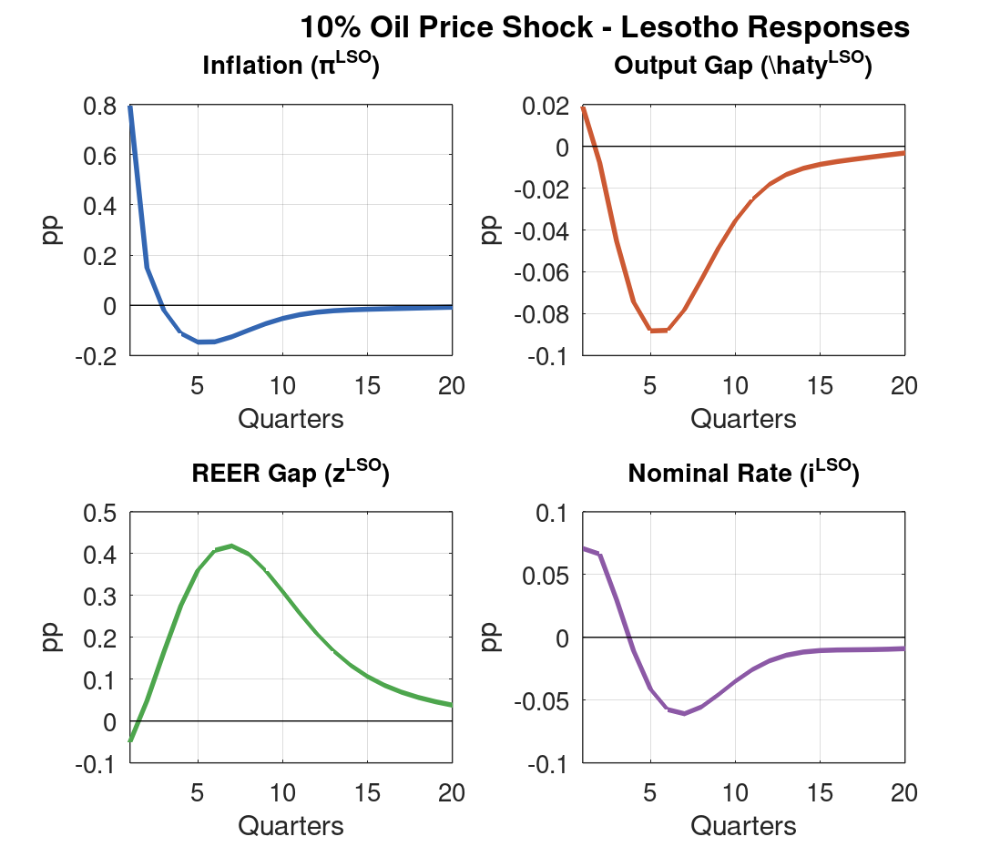
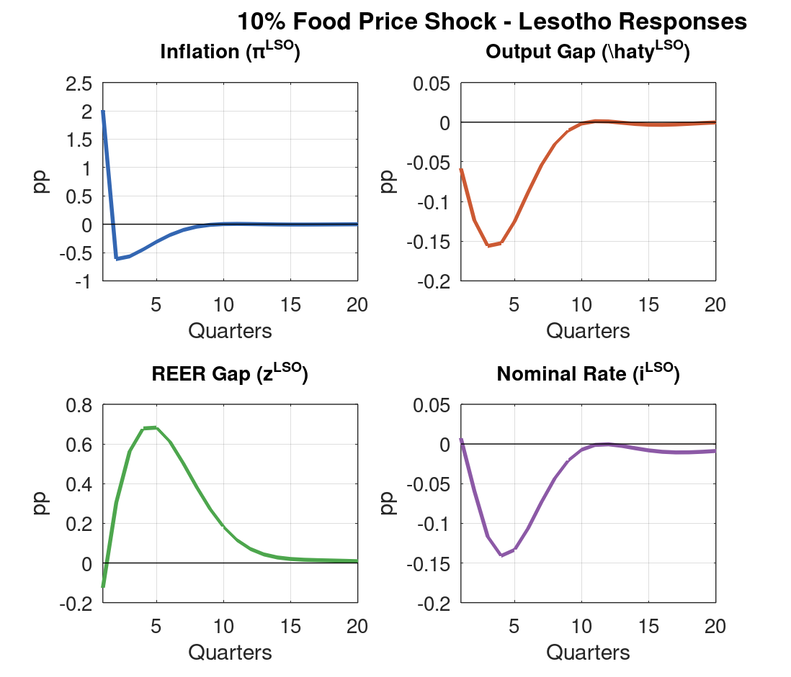
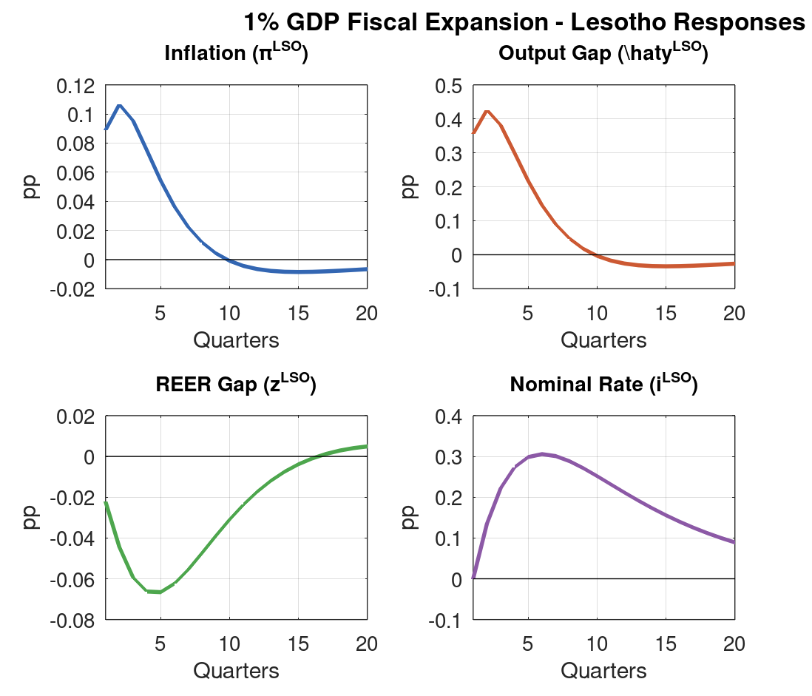
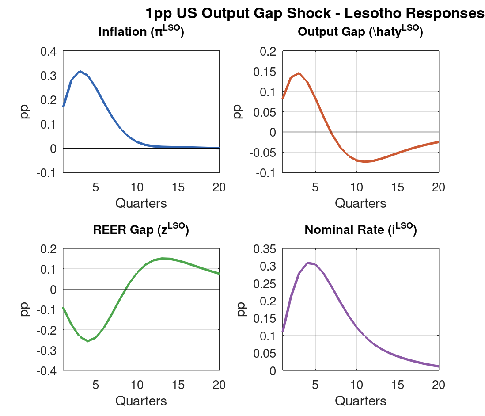
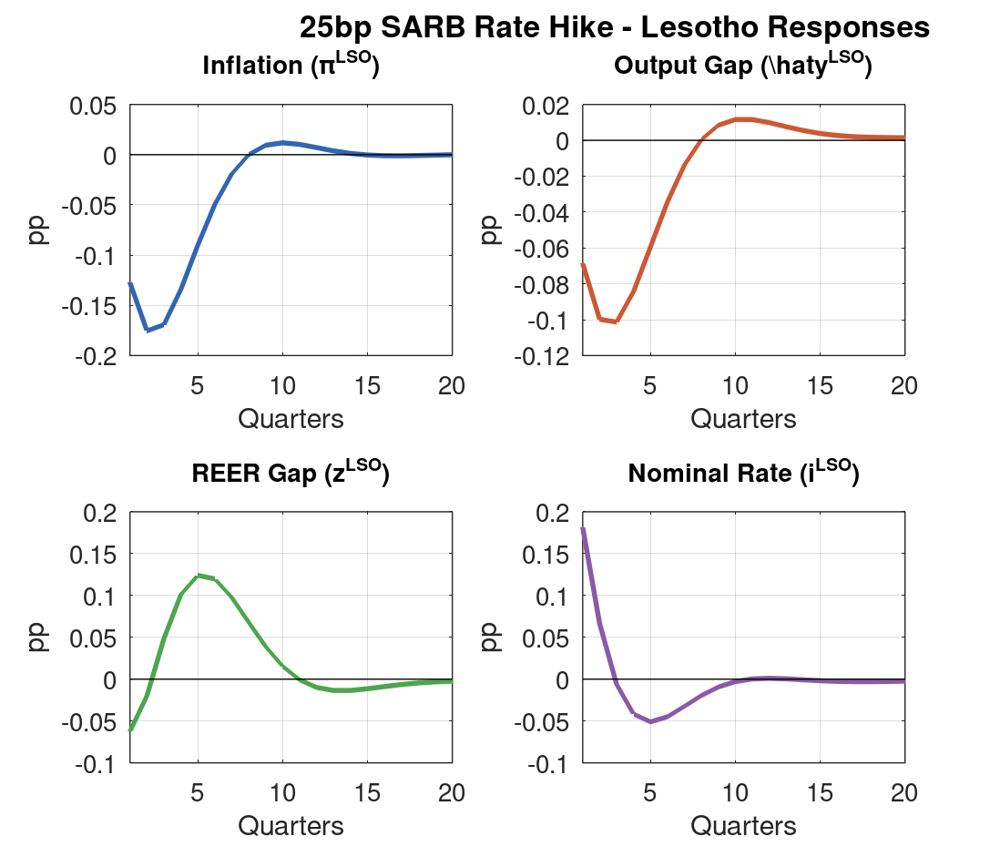
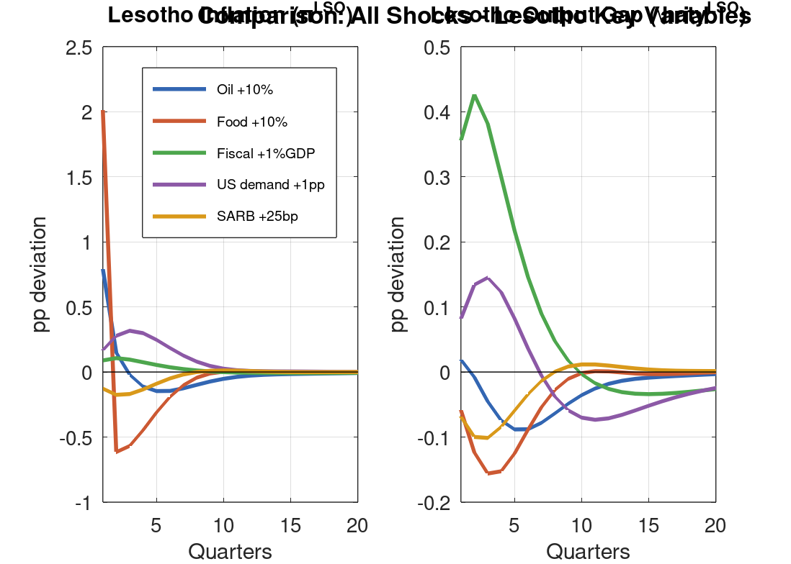

::: {.callout-note appearance="minimal"}
**Purpose:** This document provides a complete specification of the Lesotho Quarterly Projection Model (QPM) Version 4 for external review. It covers model structure, equations, calibration, transmission channels, and model properties demonstrated through five shock simulations. The document is self-contained: all information needed to assess the model is included here.
:::

## Introduction

### Purpose and Scope

The Lesotho QPM is a small open economy model designed for monetary and fiscal policy analysis in Lesotho, a country whose currency (the Loti) is pegged to the South African Rand via the Common Monetary Area (CMA). The model captures the key features of Lesotho's macroeconomic environment: dependence on South Africa as the dominant trading partner, imported monetary policy through the exchange rate peg, vulnerability to commodity price shocks (particularly oil and food), and a reserves-based risk premium mechanism.

This document serves as a technical specification for external review. The reviewer should be able to:

1. Understand every equation and parameter in the model
2. Assess the economic logic of the transmission channels
3. Verify model properties through the provided shock simulations
4. Identify potential improvements or weaknesses

### Model Lineage

The Lesotho QPM builds on a well-established tradition of FPAS (Forecasting and Policy Analysis System) models:

- **IMF FPAS Framework:** The core gap-model architecture follows the IMF's semi-structural approach, widely used in central bank forecasting (Berg, Karam, and Laxton, 2006)
- **SARB Working Paper WP1701 (2017):** The South Africa block draws on the SARB's own QPM, particularly the commodity-augmented IS curve and hybrid Phillips curve structure
- **IMF Country Report No. 2023/269:** Lesotho-specific calibration draws on IMF Article IV estimates
- **Version history:**
  - *V1:* Basic three-block model (Lesotho, SA, RoW) with fixed commodity prices
  - *V2:* Added commodity price module (oil, food, real commodity index)
  - *V3:* Revised reserves specification to BOP-based dynamics (domestic demand leakage, SACU inflows)
  - *V4 (current):* Enriched oil/food price transmission — added direct oil and food terms to SA Phillips curve ($\lambda_4$, $\lambda_5$); added oil-to-food price linkage ($\kappa_{oil \to food}$); switched oil and food to level-based AR(1) processes

### Model Summary Statistics

| Feature | Value |
|:--------|:------|
| Total equations | 28 |
| Endogenous variables | 28 |
| Exogenous shocks | 19 |
| Parameters | 42 |
| Forward-looking variables | 5 |
| Model blocks | 4 (Lesotho, South Africa, Rest of World, Commodities) |
| Solution method | First-order perturbation (linear) |
| BK conditions | 5 eigenvalues > 1 for 5 forward-looking variables |


## Model Structure

### Block Diagram

The model consists of four interconnected blocks, with the following information flow:

```
┌─────────────────────┐     ┌──────────────────────┐
│   REST OF WORLD     │     │   COMMODITY PRICES    │
│   (US/Global)       │     │   (Oil, Food, ToT)    │
│   3 equations       │     │   8 equations         │
│   y_row, pi_row,    │────>│   poil_gap, pfood_gap │
│   i_row             │     │   rcom, pi_com, ...   │
└─────────┬───────────┘     └──────────┬────────────┘
          │                            │
          v                            v
┌──────────────────────────────────────────────────┐
│                SOUTH AFRICA                       │
│                6 equations                        │
│   y_zaf, pi_zaf, i_zaf, r_zaf, z_zaf, s_zaf     │
│   IS curve, hybrid Phillips curve, Taylor rule,   │
│   Fisher eq., UIP, REER                          │
└──────────────────────┬───────────────────────────┘
                       │
                       v
┌──────────────────────────────────────────────────┐
│                  LESOTHO                          │
│                  11 equations                     │
│   y_lso, pi_lso, i_lso, r_lso, z_lso, s_lso,   │
│   res_gap_lso, res_lso, res_bar_lso, prem_lso,  │
│   g_lso                                          │
│   IS curve, Phillips curve, peg, interest rate,  │
│   Fisher eq., REER, reserves (3), premium,       │
│   fiscal                                         │
└──────────────────────────────────────────────────┘
```

Key structural features:

- **Unidirectional transmission:** RoW → SA → Lesotho. Lesotho is too small to affect SA or global variables.
- **Commodity prices affect both SA and Lesotho** through the Phillips curves, with different CPI weights creating amplification for Lesotho.
- **The exchange rate peg** eliminates Lesotho's independent monetary policy. Interest rates are imported from SA plus a risk premium.

### Variable Listing

**Lesotho (11 variables):**

| Variable | Symbol | Description |
|:---------|:-------|:------------|
| `y_lso` | $\hat{y}^{LSO}$ | Output gap (% deviation from potential) |
| `pi_lso` | $\pi^{LSO}$ | CPI inflation (annualised) |
| `i_lso` | $i^{LSO}$ | Nominal interest rate (CBL policy rate) |
| `r_lso` | $r^{LSO}$ | Real interest rate (ex ante) |
| `z_lso` | $z^{LSO}$ | Real effective exchange rate gap (+ = depreciation) |
| `s_lso` | $s^{LSO}$ | Nominal exchange rate (Loti/USD, log) |
| `res_gap_lso` | $\widetilde{res}^{LSO}$ | Reserves gap (deviation from desired level) |
| `res_lso` | $res^{LSO}$ | International reserves (months of imports) |
| `res_bar_lso` | $\overline{res}^{LSO}$ | Desired (trend) reserves level |
| `prem_lso` | $prem^{LSO}$ | Currency risk premium |
| `g_lso` | $g^{LSO}$ | Government spending shock (% of GDP) |

**South Africa (6 variables):**

| Variable | Symbol | Description |
|:---------|:-------|:------------|
| `y_zaf` | $\hat{y}^{ZAF}$ | Output gap |
| `pi_zaf` | $\pi^{ZAF}$ | CPI inflation |
| `i_zaf` | $i^{ZAF}$ | SARB policy rate |
| `r_zaf` | $r^{ZAF}$ | Real interest rate |
| `z_zaf` | $z^{ZAF}$ | Real effective exchange rate gap |
| `s_zaf` | $s^{ZAF}$ | Nominal exchange rate (Rand/USD, log) |

**Rest of World (3 variables):**

| Variable | Symbol | Description |
|:---------|:-------|:------------|
| `y_row` | $\hat{y}^{US}$ | US output gap |
| `pi_row` | $\pi^{US}$ | US CPI inflation |
| `i_row` | $i^{US}$ | US Fed funds rate |

**Commodity Prices (8 variables):**

| Variable | Symbol | Description |
|:---------|:-------|:------------|
| `poil_gap` | $p^{oil}$ | Oil price level gap (log deviation from trend) |
| `pi_oil` | $\pi^{oil}$ | Oil price inflation (first difference of level) |
| `pfood_gap` | $p^{food}$ | Food price level gap (log deviation from trend) |
| `pi_food` | $\pi^{food}$ | Food price inflation (first difference of level) |
| `rcom` | $rcom$ | Real commodity price index (terms of trade) |
| `rcom_bar` | $\overline{rcom}$ | Trend component of real commodity price |
| `d_rcom` | $\widetilde{rcom}$ | Commodity price gap (deviation from trend) |
| `pi_com` | $\pi^{com}$ | Nominal commodity price inflation |


## Model Equations

### Lesotho Block (11 equations)

**Equation 1: IS Curve (Aggregate Demand)**

$$\hat{y}^{LSO}_t = \alpha_1 \hat{y}^{LSO}_{t-1} + \alpha_2 E_t[\hat{y}^{LSO}_{t+1}] + \alpha_3 \hat{y}^{ZAF}_t - \alpha_4 \left(\alpha_5 r^{LSO}_t + (1-\alpha_5) z^{LSO}_t\right) + \alpha_6 g^{LSO}_t + \varepsilon^{y,LSO}_t$$

| Parameter | Value | Interpretation |
|:----------|:-----:|:---------------|
| $\alpha_1$ | 0.50 | Output persistence (lagged output gap) |
| $\alpha_2$ | 0.10 | Forward-looking expectations |
| $\alpha_3$ | 0.30 | SA output spillover (trade channel) |
| $\alpha_4$ | 0.20 | Monetary conditions sensitivity |
| $\alpha_5$ | 0.50 | Weight on interest rate vs. REER in monetary conditions |
| $\alpha_6$ | 0.30 | Fiscal multiplier |

*Economic interpretation:* Lesotho output depends on its own lag (habit formation), forward expectations, SA demand (trade linkage — Lesotho exports primarily to SA), monetary conditions (equally weighted between real interest rate and real exchange rate), and fiscal impulse. The moderate fiscal multiplier ($\alpha_6 = 0.30$) reflects Lesotho's high import leakage — much of government spending flows to SA imports.

**Equation 2: Phillips Curve (Aggregate Supply)**

$$\pi^{LSO}_t = \pi^{ZAF}_t + (\omega^{LSO}_1 - \omega^{ZAF}_1) \pi^{oil}_t + (\omega^{LSO}_2 - \omega^{ZAF}_2) \pi^{food}_t + \beta_1 \hat{y}^{LSO}_t + \varepsilon^{u,LSO}_t + \rho_u \varepsilon^{u,LSO}_{t-1} + \varepsilon^{\pi,LSO}_t$$

| Parameter | Value | Interpretation |
|:----------|:-----:|:---------------|
| $\beta_1$ | 0.25 | Output gap effect on inflation |
| $\omega^{LSO}_1$ | 0.08 | Oil weight in Lesotho CPI basket |
| $\omega^{ZAF}_1$ | 0.05 | Oil weight in SA CPI basket |
| $\omega^{LSO}_2$ | 0.35 | Food weight in Lesotho CPI basket |
| $\omega^{ZAF}_2$ | 0.20 | Food weight in SA CPI basket |
| $\rho_u$ | 0.50 | Persistent supply shock AR coefficient |

*Economic interpretation:* Lesotho inflation is anchored to SA inflation (peg pass-through) plus adjustments for differing CPI basket composition. The oil CPI differential ($0.08 - 0.05 = 0.03$) and food CPI differential ($0.35 - 0.20 = 0.15$) mean that commodity price shocks are amplified in Lesotho relative to SA. The domestic output gap adds demand-pull pressure. A persistent supply shock ($\rho_u = 0.50$) captures structural cost-push factors.

**Equation 3: Exchange Rate Peg**

$$s^{LSO}_t = s^{ZAF}_t + \varepsilon^{s,LSO}_t$$

*The Loti is pegged 1:1 to the Rand. The shock allows for temporary deviations (e.g., capital controls).*

**Equation 4: Interest Rate Rule**

$$i^{LSO}_t = i^{ZAF}_t + prem^{LSO}_t + \varepsilon^{i,LSO}_t$$

*The CBL imports SARB policy rates plus a risk premium. No independent monetary policy.*

**Equation 5: Fisher Equation**

$$r^{LSO}_t = i^{LSO}_t - E_t[\pi^{LSO}_{t+1}]$$

*Standard ex ante real interest rate definition.*

**Equation 6: Real Effective Exchange Rate Gap**

$$z^{LSO}_t = \rho_z z^{LSO}_{t-1} + (s^{LSO}_t - s^{LSO}_{t-1}) - \frac{\pi^{LSO}_t - \pi^{ZAF}_t}{4}$$

| Parameter | Value | Interpretation |
|:----------|:-----:|:---------------|
| $\rho_z$ | 0.80 | REER persistence (PPP mean-reversion) |

*Captures real exchange rate dynamics via purchasing power parity adjustment. Division by 4 converts quarterly inflation differential to annualised rate.*

**Equation 7: Reserves Gap (BOP-based, V3 specification)**

$$\widetilde{res}^{LSO}_t = \delta_{res} \widetilde{res}^{LSO}_{t-1} - f_1 g^{LSO}_{t-1} - f_3 \hat{y}^{LSO}_{t-1} + f_4 \hat{y}^{ZAF}_{t-1} + \varepsilon^{res,LSO}_t$$

| Parameter | Value | Interpretation |
|:----------|:-----:|:---------------|
| $\delta_{res}$ | 0.90 | Reserves gap persistence |
| $f_1$ | 0.35 | Fiscal spending leakage to imports |
| $f_3$ | 0.10 | Domestic demand leakage to imports |
| $f_4$ | 0.02 | SA demand effect (SACU revenue inflows) |

*Reserve dynamics are driven by the balance of payments: fiscal expansion drains reserves through import leakage ($f_1$), domestic demand growth increases imports ($f_3$), and SA growth generates SACU revenue inflows ($f_4$). All effects are lagged one quarter, reflecting BOP settlement timing.*

**Equation 8: Desired Reserves (AR process)**

$$\overline{res}^{LSO}_t = (1 - \rho_{\overline{res}}) \cdot res_{ss} + \rho_{\overline{res}} \cdot \overline{res}^{LSO}_{t-1}$$

| Parameter | Value | Interpretation |
|:----------|:-----:|:---------------|
| $\rho_{\overline{res}}$ | 0.90 | Trend reserves AR coefficient |
| $res_{ss}$ | 4.70 | Steady-state reserves (months of imports) |

*Desired reserves converge slowly to the ARA (Assessing Reserve Adequacy) target of 4.7 months of imports for commodity-exporting economies.*

**Equation 9: Actual Reserves (identity)**

$$res^{LSO}_t = \widetilde{res}^{LSO}_t + \overline{res}^{LSO}_t$$

**Equation 10: Risk Premium**

$$prem^{LSO}_t = \theta_{prem} (\overline{res}^{LSO}_t - res^{LSO}_t) + \varepsilon^{prem,LSO}_t$$

| Parameter | Value | Interpretation |
|:----------|:-----:|:---------------|
| $\theta_{prem}$ | 0.35 | Reserves gap effect on premium |

*When reserves fall below desired levels ($res < \overline{res}$), the risk premium rises, increasing borrowing costs. This creates a stabilising feedback: reserve losses → higher premium → tighter monetary conditions → lower demand → current account improvement → reserve recovery.*

**Equation 11: Government Spending (AR process)**

$$g^{LSO}_t = \rho_g g^{LSO}_{t-1} + \varepsilon^{g,LSO}_t$$

| Parameter | Value | Interpretation |
|:----------|:-----:|:---------------|
| $\rho_g$ | 0.70 | Fiscal shock persistence |

### South Africa Block (6 equations)

**Equation 12: IS Curve (Commodity-augmented)**

$$\hat{y}^{ZAF}_t = \gamma_1 \hat{y}^{ZAF}_{t-1} + \gamma_2 E_t[\hat{y}^{ZAF}_{t+1}] - \gamma_3 r^{ZAF}_t + \gamma_4 z^{ZAF}_t + \gamma_5 \hat{y}^{US}_t + \gamma_6 \widetilde{rcom}_t + \varepsilon^{y,ZAF}_t$$

| Parameter | Value | Interpretation |
|:----------|:-----:|:---------------|
| $\gamma_1$ | 0.55 | Output persistence |
| $\gamma_2$ | 0.10 | Forward-looking expectations |
| $\gamma_3$ | 0.25 | Real interest rate effect |
| $\gamma_4$ | 0.08 | Real exchange rate effect (competitiveness) |
| $\gamma_5$ | 0.10 | US output spillover |
| $\gamma_6$ | 0.01 | Commodity terms of trade effect |

*SA output responds to real interest rates, exchange rate competitiveness, US demand, and commodity terms of trade. The commodity channel ($\gamma_6 = 0.01$) is small — following the SARB WP1701 calibration — as SA's terms of trade effect operates primarily through the exchange rate channel rather than direct output effects.*

**Equation 13: Phillips Curve (Hybrid, V4)**

$$\pi^{ZAF}_t = \lambda_1 \pi^{ZAF}_{t-1} + (1-\lambda_1) E_t[\pi^{ZAF}_{t+1}] + \lambda_2 \hat{y}^{ZAF}_t + \lambda_3 (\Delta z^{ZAF}_t) + \lambda_4 \pi^{oil}_t + \lambda_5 \pi^{food}_t + \varepsilon^{\pi,ZAF}_t$$

| Parameter | Value | Interpretation |
|:----------|:-----:|:---------------|
| $\lambda_1$ | 0.50 | Backward-looking (persistence) weight |
| $\lambda_2$ | 0.30 | Output gap effect |
| $\lambda_3$ | 0.15 | REER change pass-through |
| $\lambda_4$ | 0.03 | Oil price pass-through (**V4 addition**) |
| $\lambda_5$ | 0.05 | Food price pass-through (**V4 addition**) |

*This is the key V4 innovation. The SA Phillips curve now responds directly to oil and food price inflation, in addition to the output gap and exchange rate channels. The 50/50 backward/forward-looking split means that anticipated shocks propagate backward through expectations. The oil pass-through ($\lambda_4 = 0.03$) reflects SA's fuel CPI weight of 4.58% multiplied by the BFP (Basic Fuel Price) pass-through coefficient. The food pass-through ($\lambda_5 = 0.05$) reflects SA's food CPI weight of 17.24% multiplied by the international-to-domestic pass-through rate.*

**Equation 14: Taylor Rule**

$$i^{ZAF}_t = \phi_i i^{ZAF}_{t-1} + (1-\phi_i)\left(\phi_\pi E_t[\pi^{ZAF}_{t+1}] + \phi_y \hat{y}^{ZAF}_t\right) + \varepsilon^{i,ZAF}_t$$

| Parameter | Value | Interpretation |
|:----------|:-----:|:---------------|
| $\phi_i$ | 0.75 | Interest rate smoothing |
| $\phi_\pi$ | 1.50 | Inflation response (Taylor principle satisfied) |
| $\phi_y$ | 0.50 | Output gap response |
| $\pi^{target}_{ZAF}$ | 4.50 | SARB inflation target midpoint (not active in gap model) |

*The SARB Taylor rule features strong smoothing ($\phi_i = 0.75$), meaning only 25% of the desired policy adjustment occurs each quarter. The Taylor principle ($\phi_\pi = 1.50 > 1$) ensures determinacy. The inflation target does not appear explicitly because the model is written in gap form (all variables are deviations from steady state).*

**Equation 15: Fisher Equation**

$$r^{ZAF}_t = i^{ZAF}_t - E_t[\pi^{ZAF}_{t+1}]$$

**Equation 16: Uncovered Interest Parity (Hybrid)**

$$s^{ZAF}_t = \sigma_s s^{ZAF}_{t-1} + (1-\sigma_s) E_t[s^{ZAF}_{t+1}] - \frac{i^{ZAF}_t - i^{US}_t}{4} + \varepsilon^{s,ZAF}_t$$

| Parameter | Value | Interpretation |
|:----------|:-----:|:---------------|
| $\sigma_s$ | 0.50 | Backward-looking weight in UIP |

*Hybrid UIP with equal forward/backward-looking weights. The interest differential is divided by 4 to convert from annualised rates to quarterly exchange rate movements.*

**Equation 17: REER Gap (South Africa)**

$$z^{ZAF}_t = \rho_z z^{ZAF}_{t-1} + (s^{ZAF}_t - s^{ZAF}_{t-1}) - \frac{\pi^{ZAF}_t - \pi^{US}_t}{4}$$

### Rest of World Block (3 equations)

**Equation 18: US Output Gap**

$$\hat{y}^{US}_t = \rho_{y,US} \hat{y}^{US}_{t-1} + \varepsilon^{y,US}_t$$

| Parameter | Value | Interpretation |
|:----------|:-----:|:---------------|
| $\rho_{y,US}$ | 0.80 | US output gap persistence |

**Equation 19: US Inflation**

$$\pi^{US}_t = \rho_{\pi,US} \pi^{US}_{t-1} + \varepsilon^{\pi,US}_t$$

| Parameter | Value | Interpretation |
|:----------|:-----:|:---------------|
| $\rho_{\pi,US}$ | 0.50 | US inflation persistence |

**Equation 20: US Interest Rate (Taylor-type)**

$$i^{US}_t = \rho_{i,US} i^{US}_{t-1} + (1-\rho_{i,US})(1.5 \pi^{US}_t + 0.5 \hat{y}^{US}_t) + \varepsilon^{i,US}_t$$

| Parameter | Value | Interpretation |
|:----------|:-----:|:---------------|
| $\rho_{i,US}$ | 0.75 | US interest rate persistence |

### Commodity Prices Block (8 equations)

**Equation 21: Real Commodity Price (identity)**

$$rcom_t = \overline{rcom}_t + \widetilde{rcom}_t$$

**Equation 22: Commodity Price Trend (random walk)**

$$\overline{rcom}_t = \overline{rcom}_{t-1} + \varepsilon^{\overline{rcom}}_t$$

**Equation 23: Commodity Price Gap (AR(1))**

$$\widetilde{rcom}_t = \rho_{\widetilde{rcom}} \widetilde{rcom}_{t-1} + \varepsilon^{com}_t$$

| Parameter | Value | Interpretation |
|:----------|:-----:|:---------------|
| $\rho_{\widetilde{rcom}}$ | 0.70 | Commodity price gap persistence |

**Equation 24: Nominal Commodity Inflation (identity)**

$$\pi^{com}_t = \pi^{US}_t + (rcom_t - rcom_{t-1})$$

**Equation 25: Oil Price Level Gap (V4: AR(1) on level)**

$$p^{oil}_t = \rho_{oil} \cdot p^{oil}_{t-1} + \varepsilon^{oil}_t$$

| Parameter | Value | Interpretation |
|:----------|:-----:|:---------------|
| $\rho_{oil}$ | 0.80 | Oil price level persistence (half-life $\approx$ 3.1 quarters) |

*This is a key design choice. Modelling oil prices as a level gap (rather than inflation persistence) means a one-time oil price shock produces transient inflation followed by deflationary reversion — matching the empirical observation that oil price shocks have temporary inflation effects.*

**Equation 26: Oil Price Inflation (identity)**

$$\pi^{oil}_t = p^{oil}_t - p^{oil}_{t-1}$$

**Equation 27: Food Price Level Gap (V4: oil-to-food linkage)**

$$p^{food}_t = \rho_{food} \cdot p^{food}_{t-1} + \kappa_{oil \to food} \cdot p^{oil}_t + \varepsilon^{food}_t$$

| Parameter | Value | Interpretation |
|:----------|:-----:|:---------------|
| $\rho_{food}$ | 0.60 | Food price level persistence (half-life $\approx$ 1.4 quarters) |
| $\kappa_{oil \to food}$ | 0.05 | Oil-to-food price pass-through (**V4 addition**) |

*Energy costs represent 15--20% of food production costs. The linkage at the level (not inflation) means elevated oil prices continuously feed into food prices. The SARB WP1701 estimates a direct coefficient of 0.033; our value of 0.05 is scaled up for the reduced-form cumulative effect.*

**Equation 28: Food Price Inflation (identity)**

$$\pi^{food}_t = p^{food}_t - p^{food}_{t-1}$$


## Calibration

### Full Parameter Table

| Parameter | Symbol | Value | Block | Source/Rationale |
|:----------|:------:|:-----:|:-----:|:-----------------|
| $\alpha_1$ | Output persistence | 0.50 | LSO IS | Standard FPAS |
| $\alpha_2$ | Forward-looking output | 0.10 | LSO IS | Low for developing economy |
| $\alpha_3$ | SA spillover | 0.30 | LSO IS | IMF CR/2023/269 |
| $\alpha_4$ | Monetary conditions | 0.20 | LSO IS | Adjusted from 0.45 for realism |
| $\alpha_5$ | Interest rate weight | 0.50 | LSO IS | Equal r/z weighting |
| $\alpha_6$ | Fiscal multiplier | 0.30 | LSO IS | High import leakage |
| $\beta_1$ | Output gap on inflation | 0.25 | LSO PC | Standard |
| $\omega^{LSO}_1$ | Oil CPI weight | 0.08 | LSO PC | Lesotho CPI basket |
| $\omega^{ZAF}_1$ | Oil CPI weight (SA) | 0.05 | LSO PC | SA CPI basket |
| $\omega^{LSO}_2$ | Food CPI weight | 0.35 | LSO PC | Lesotho CPI basket |
| $\omega^{ZAF}_2$ | Food CPI weight (SA) | 0.20 | LSO PC | SA CPI basket |
| $\rho_u$ | Supply shock persistence | 0.50 | LSO PC | Standard |
| $\delta_{res}$ | Reserves persistence | 0.90 | LSO Res | BOP-based (V3) |
| $f_1$ | Fiscal import leakage | 0.35 | LSO Res | High import dependence |
| $f_3$ | Demand import leakage | 0.10 | LSO Res | V3 assessment report |
| $f_4$ | SA/SACU inflows | 0.02 | LSO Res | Weak SACU effect |
| $\rho_{\overline{res}}$ | Trend reserves AR | 0.90 | LSO Res | Slow convergence |
| $res_{ss}$ | Target reserves | 4.70 | LSO Res | ARA for CCEs |
| $\theta_{prem}$ | Reserves → premium | 0.35 | LSO Prem | Moderate sensitivity |
| $\rho_g$ | Fiscal persistence | 0.70 | LSO Fiscal | Standard |
| $\rho_z$ | REER persistence | 0.80 | REER | Both LSO and ZAF |
| $\gamma_1$ | SA output persistence | 0.55 | ZAF IS | SARB WP1701 |
| $\gamma_2$ | SA forward-looking | 0.10 | ZAF IS | SARB WP1701 |
| $\gamma_3$ | SA real rate effect | 0.25 | ZAF IS | SARB WP1701 |
| $\gamma_4$ | SA REER effect | 0.08 | ZAF IS | SARB WP1701 |
| $\gamma_5$ | US spillover to SA | 0.10 | ZAF IS | SARB WP1701 |
| $\gamma_6$ | Commodity ToT effect | 0.01 | ZAF IS | SARB WP1701 ($a_6$) |
| $\lambda_1$ | SA inflation persistence | 0.50 | ZAF PC | SARB WP1701 |
| $\lambda_2$ | SA output gap effect | 0.30 | ZAF PC | SARB WP1701 |
| $\lambda_3$ | SA REER pass-through | 0.15 | ZAF PC | SARB WP1701 |
| $\lambda_4$ | Oil → SA inflation | 0.03 | ZAF PC | V4: fuel CPI × BFP |
| $\lambda_5$ | Food → SA inflation | 0.05 | ZAF PC | V4: food CPI × pass-through |
| $\phi_i$ | SARB smoothing | 0.75 | ZAF Taylor | SARB WP1701 |
| $\phi_\pi$ | SARB inflation response | 1.50 | ZAF Taylor | Taylor principle |
| $\phi_y$ | SARB output response | 0.50 | ZAF Taylor | Standard |
| $\sigma_s$ | UIP backward weight | 0.50 | ZAF UIP | Hybrid UIP |
| $\rho_{y,US}$ | US output persistence | 0.80 | RoW | Standard |
| $\rho_{\pi,US}$ | US inflation persistence | 0.50 | RoW | Standard |
| $\rho_{i,US}$ | US rate persistence | 0.75 | RoW | Standard |
| $\rho_{oil}$ | Oil price persistence | 0.80 | Commodities | Half-life 3.1Q |
| $\rho_{food}$ | Food price persistence | 0.60 | Commodities | Half-life 1.4Q |
| $\rho_{\widetilde{rcom}}$ | Commodity gap persistence | 0.70 | Commodities | SARB WP1701 |
| $\kappa_{oil \to food}$ | Oil → food linkage | 0.05 | Commodities | V4: energy cost share |

### Key Calibration Rationale

**SA spillover ($\alpha_3 = 0.30$):** Lesotho's economy is heavily dependent on South Africa — approximately 75% of imports originate from SA, and significant remittance flows and SACU revenues create a strong real-sector linkage. The value of 0.30 implies a 1pp SA output gap increase raises Lesotho's output gap by 0.30pp on impact.

**CPI weight differentials:** Lesotho's CPI basket has higher food (35% vs 20%) and oil (8% vs 5%) weights than South Africa's, reflecting lower income levels and less diversified consumption. These differentials are the primary mechanism through which commodity shocks are amplified in Lesotho relative to SA.

**Monetary conditions weight ($\alpha_4 = 0.20$):** This was adjusted down from the original IMF calibration of 0.45 to produce more realistic output responses to monetary shocks. The lower value reflects Lesotho's shallow financial markets, where interest rate transmission is weaker than in more developed economies.

**Reserves import leakage ($f_1 = 0.35$):** Lesotho's high import dependence means a substantial share of government spending leaks to imports, draining reserves. This is the key channel linking fiscal policy to external vulnerability.

**Oil price persistence ($\rho_{oil} = 0.80$):** Calibrated to match the empirical observation that global oil price shocks have half-lives of approximately 3 quarters. This is higher than the initial calibration of 0.70 (half-life 1.9Q), producing more persistent effects that better match observed oil price dynamics.


## Transmission Channels

### Channel 1: Oil Price → Lesotho Inflation

**Direct channel (CPI weight differential):**

$\pi^{oil} \xrightarrow{(\omega^{LSO}_1 - \omega^{ZAF}_1) = 0.03} \pi^{LSO}$

**Via SA Phillips curve (V4):**

$\pi^{oil} \xrightarrow{\lambda_4 = 0.03} \pi^{ZAF} \xrightarrow{1:1} \pi^{LSO}$

**Via food prices (V4):**

$p^{oil} \xrightarrow{\kappa_{oil \to food} = 0.05} p^{food} \xrightarrow{\Delta} \pi^{food} \xrightarrow{(\omega^{LSO}_2 - \omega^{ZAF}_2) = 0.15} \pi^{LSO}$

*Total oil impact on Lesotho inflation is approximately $0.03 + 0.03 + 0.15 \times 0.05 = 0.0675$ times the oil price inflation rate, plus second-round effects through the output gap and expectations.*

### Channel 2: Food Price → Lesotho Inflation

**Direct channel:**

$\pi^{food} \xrightarrow{(\omega^{LSO}_2 - \omega^{ZAF}_2) = 0.15} \pi^{LSO}$

**Via SA Phillips curve (V4):**

$\pi^{food} \xrightarrow{\lambda_5 = 0.05} \pi^{ZAF} \xrightarrow{1:1} \pi^{LSO}$

*Food price shocks have a larger direct impact on Lesotho inflation than oil shocks because of the large food CPI weight differential (15pp vs 3pp).*

### Channel 3: SA Monetary Policy → Lesotho

$$i^{LSO} = i^{ZAF} + prem^{LSO}$$
$$r^{LSO} = i^{LSO} - E[\pi^{LSO}_{t+1}]$$

The real rate enters the IS curve with coefficient $-\alpha_4 \alpha_5 = -0.10$:

$\varepsilon^{i,ZAF} \xrightarrow{1:1} i^{LSO} \xrightarrow{-0.10} \hat{y}^{LSO}$

*SARB rate changes transmit one-for-one to Lesotho nominal rates via the peg, affecting Lesotho's real rate and output gap.*

### Channel 4: Fiscal Policy → Reserves → Risk Premium

$g^{LSO} \xrightarrow{\alpha_6 = 0.30} \hat{y}^{LSO}$ (direct fiscal multiplier)

$g^{LSO}_{t-1} \xrightarrow{-f_1 = -0.35} \widetilde{res}^{LSO} \xrightarrow{-\theta_{prem} = -0.35} prem^{LSO} \rightarrow i^{LSO}$

*Fiscal expansion boosts output directly but drains reserves through import leakage, raising the risk premium and partially offsetting the expansionary effect. This creates an endogenous fiscal stabiliser.*

### Channel 5: Global Demand → SA → Lesotho

$\hat{y}^{US} \xrightarrow{\gamma_5 = 0.10} \hat{y}^{ZAF} \xrightarrow{\alpha_3 = 0.30} \hat{y}^{LSO}$

*US demand shocks reach Lesotho indirectly via SA output. The compound effect is approximately $0.10 \times 0.30 = 0.03$ on impact, but dynamic effects through SA interest rates and exchange rates amplify this substantially over time.*


## Model Properties: Shock Simulations

This section presents impulse response functions (IRFs) for five representative shocks, demonstrating the model's transmission channels and dynamic properties. All shocks are unanticipated, single-period impulses solved via first-order perturbation. Values are in percentage points deviation from steady state.

### Shock 1: 10% Oil Price Increase

**Specification:** $\varepsilon^{oil} = 0.10$ (one standard deviation = 10% oil price level gap increase)

**Transmission:** Oil price increase → (1) direct Lesotho CPI weight differential, (2) SA Phillips curve oil term, (3) oil-to-food spillover → food CPI differential, (4) SARB tightening → higher Lesotho rates.

| Quarter | $\pi^{LSO}$ | $\hat{y}^{LSO}$ | $z^{LSO}$ | $i^{LSO}$ | $r^{LSO}$ | $\pi^{ZAF}$ | $\hat{y}^{ZAF}$ |
|:-------:|:---:|:---:|:---:|:---:|:---:|:---:|:---:|
| Q1 | +0.79 | +0.02 | -0.05 | +0.07 | -0.08 | +0.41 | +0.02 |
| Q2 | +0.15 | -0.01 | +0.05 | +0.07 | +0.09 | +0.18 | +0.00 |
| Q4 | -0.11 | -0.07 | +0.28 | -0.01 | +0.14 | -0.05 | -0.01 |
| Q8 | -0.10 | -0.06 | +0.40 | -0.06 | +0.02 | -0.06 | +0.07 |
| Q12 | -0.03 | -0.02 | +0.21 | -0.02 | +0.00 | -0.01 | +0.06 |
| Q20 | -0.01 | -0.00 | +0.04 | -0.01 | -0.00 | -0.00 | +0.01 |

**Narrative:** The oil shock produces a sharp initial inflation spike (+0.79pp) driven by the CPI weight differential and SA inflation pass-through. With the level-based oil price specification, inflation reverses after Q1 as the oil price level decays (the *change* in the oil price gap turns negative). The real rate rises from Q2 onward, contracting output gradually. The REER depreciates persistently as Lesotho's inflation differential erodes competitiveness. By Q12, the economy has largely returned to steady state.

{width=90%}

### Shock 2: 10% Food Price Increase

**Specification:** $\varepsilon^{food} = 0.10$ (10% food price level gap increase)

**Transmission:** Food price increase → (1) large direct Lesotho CPI weight differential ($\omega^{LSO}_2 - \omega^{ZAF}_2 = 0.15$), (2) SA Phillips curve food term ($\lambda_5 = 0.05$).

| Quarter | $\pi^{LSO}$ | $\hat{y}^{LSO}$ | $z^{LSO}$ | $i^{LSO}$ | $r^{LSO}$ | $\pi^{ZAF}$ | $\hat{y}^{ZAF}$ |
|:-------:|:---:|:---:|:---:|:---:|:---:|:---:|:---:|
| Q1 | +2.01 | -0.06 | -0.13 | +0.01 | +0.62 | +0.53 | +0.01 |
| Q2 | -0.62 | -0.12 | +0.30 | -0.06 | +0.51 | +0.02 | +0.01 |
| Q4 | -0.45 | -0.15 | +0.68 | -0.14 | +0.17 | -0.19 | +0.08 |
| Q8 | -0.04 | -0.03 | +0.38 | -0.04 | -0.03 | -0.01 | +0.12 |
| Q12 | +0.00 | +0.00 | +0.07 | -0.00 | +0.00 | +0.01 | +0.03 |
| Q20 | -0.00 | -0.00 | +0.01 | -0.01 | -0.01 | -0.00 | +0.00 |

**Narrative:** The food shock produces the largest inflation spike of all five scenarios (+2.01pp) due to Lesotho's high food CPI weight. The effect is even larger than the oil shock despite the same percentage increase, because the food CPI differential (15pp) far exceeds the oil CPI differential (3pp). The sharp reversal in Q2 (-0.62pp) reflects the level-based specification: food prices are still elevated but no longer rising. Output contracts more strongly than under the oil shock, and the REER depreciates persistently. The faster food price decay ($\rho_{food} = 0.60$ vs $\rho_{oil} = 0.80$) means the shock dissipates more quickly.

{width=90%}

### Shock 3: 1% GDP Fiscal Expansion

**Specification:** $\varepsilon^{g,LSO} = 0.01$ (1% of GDP government spending increase)

**Transmission:** Fiscal expansion → (1) direct output boost ($\alpha_6 = 0.30$), (2) reserves drain via import leakage ($f_1 = 0.35$), (3) rising risk premium ($\theta_{prem} = 0.35$), (4) demand-pull inflation ($\beta_1 = 0.25$).

| Quarter | $\pi^{LSO}$ | $\hat{y}^{LSO}$ | $z^{LSO}$ | $i^{LSO}$ | $r^{LSO}$ | $\widetilde{res}$ | $prem$ |
|:-------:|:---:|:---:|:---:|:---:|:---:|:---:|:---:|
| Q1 | +0.09 | +0.36 | -0.02 | -0.00 | -0.11 | +0.00 | -0.00 |
| Q2 | +0.11 | +0.43 | -0.04 | +0.14 | +0.04 | -0.39 | +0.13 |
| Q4 | +0.08 | +0.30 | -0.07 | +0.27 | +0.22 | -0.78 | +0.27 |
| Q8 | +0.01 | +0.05 | -0.05 | +0.29 | +0.28 | -0.82 | +0.29 |
| Q12 | -0.01 | -0.03 | -0.02 | +0.21 | +0.22 | -0.60 | +0.21 |
| Q20 | -0.01 | -0.03 | +0.01 | +0.09 | +0.10 | -0.25 | +0.09 |

**Narrative:** The fiscal shock demonstrates the reserves-premium feedback mechanism. Output expands immediately (+0.36pp) via the fiscal multiplier, with inflation rising modestly (+0.09pp) through the output gap. However, the import leakage channel drains reserves (gap reaches -0.82pp by Q8), raising the risk premium and tightening monetary conditions. The interest rate rises by +0.29pp at Q8, almost entirely due to the premium effect (SA rates are unaffected by a Lesotho-specific shock). This endogenous tightening gradually offsets the fiscal stimulus. This shock is purely domestic — SA and RoW variables are unaffected.

{width=90%}

### Shock 4: 1pp US Output Gap Increase

**Specification:** $\varepsilon^{y,US} = 0.01$ (1 percentage point US output gap increase)

**Transmission:** US demand → SA output ($\gamma_5 = 0.10$) → Lesotho output ($\alpha_3 = 0.30$); US rates rise → SA rates rise → Lesotho rates rise. SA exchange rate appreciates.

| Quarter | $\pi^{LSO}$ | $\hat{y}^{LSO}$ | $z^{LSO}$ | $i^{LSO}$ | $r^{LSO}$ | $\pi^{ZAF}$ | $\hat{y}^{ZAF}$ |
|:-------:|:---:|:---:|:---:|:---:|:---:|:---:|:---:|
| Q1 | +0.17 | +0.08 | -0.09 | +0.11 | -0.17 | +0.15 | +0.14 |
| Q2 | +0.28 | +0.13 | -0.17 | +0.21 | -0.11 | +0.25 | +0.17 |
| Q4 | +0.30 | +0.12 | -0.26 | +0.31 | +0.06 | +0.27 | +0.07 |
| Q8 | +0.08 | -0.04 | -0.04 | +0.20 | +0.15 | +0.09 | -0.06 |
| Q12 | +0.01 | -0.07 | +0.14 | +0.08 | +0.07 | +0.03 | -0.02 |
| Q20 | -0.00 | -0.03 | +0.08 | +0.01 | +0.01 | +0.01 | +0.00 |

**Narrative:** The global demand shock illustrates the external transmission channel. US demand boosts SA output (+0.14pp on impact), which spills over to Lesotho (+0.08pp). SA inflation rises, triggering SARB tightening. Lesotho inflation peaks at +0.30pp in Q4 from the SA inflation pass-through and domestic demand-pull. The REER initially appreciates (Lesotho inflation rises relative to SA), then depreciates as the global tightening cycle raises Lesotho's real rate and contracts output. The response is persistent due to the high US output gap persistence ($\rho_{y,US} = 0.80$).

{width=90%}

### Shock 5: 25bp SARB Rate Hike

**Specification:** $\varepsilon^{i,ZAF} = 0.0025$ (25 basis point SARB policy rate shock)

**Transmission:** SARB rate hike → one-for-one Lesotho rate increase (peg) → higher real rate → output contraction → lower inflation.

| Quarter | $\pi^{LSO}$ | $\hat{y}^{LSO}$ | $z^{LSO}$ | $i^{LSO}$ | $r^{LSO}$ | $\pi^{ZAF}$ | $\hat{y}^{ZAF}$ |
|:-------:|:---:|:---:|:---:|:---:|:---:|:---:|:---:|
| Q1 | -0.13 | -0.07 | -0.06 | +0.18 | +0.36 | -0.11 | -0.10 |
| Q2 | -0.18 | -0.10 | -0.02 | +0.07 | +0.24 | -0.15 | -0.11 |
| Q4 | -0.13 | -0.08 | +0.10 | -0.04 | +0.05 | -0.11 | -0.04 |
| Q8 | +0.00 | +0.00 | +0.07 | -0.02 | -0.03 | -0.00 | +0.03 |
| Q12 | +0.01 | +0.01 | -0.01 | +0.00 | -0.00 | +0.01 | +0.01 |
| Q20 | -0.00 | +0.00 | -0.00 | -0.00 | -0.00 | -0.00 | +0.00 |

**Narrative:** The SARB tightening shock is the purest test of monetary transmission. The 25bp hike passes through one-for-one to Lesotho rates, raising the real rate by +0.36pp on impact (amplified because expected inflation falls). Output contracts immediately (-0.07pp) and inflation falls (-0.13pp). SA output contracts more than Lesotho initially (-0.10 vs -0.07pp) because SA has a direct interest rate channel in its IS curve ($\gamma_3 = 0.25$), while Lesotho's output responds partly through the SA spillover. The shock is temporary — the SARB smoothing parameter ($\phi_i = 0.75$) means the rate hike decays at 25% per quarter, and the economy returns to steady state by Q8--Q10.

{width=90%}

### Summary: Peak Responses Across Shocks

| Shock | $\pi^{LSO}$ peak | $\hat{y}^{LSO}$ peak | $z^{LSO}$ peak | $i^{LSO}$ peak | Time to half-life |
|:------|:---:|:---:|:---:|:---:|:---:|
| Oil +10% | +0.79 (Q1) | -0.09 (Q6) | +0.41 (Q8) | +0.07 (Q1) | ~4Q |
| Food +10% | +2.01 (Q1) | -0.16 (Q4) | +0.68 (Q4) | -0.14 (Q4) | ~3Q |
| Fiscal +1%GDP | +0.11 (Q2) | +0.43 (Q2) | -0.07 (Q4) | +0.31 (Q6) | ~8Q |
| US demand +1pp | +0.30 (Q4) | +0.15 (Q3) | -0.26 (Q4) | +0.31 (Q4) | ~6Q |
| SARB +25bp | -0.18 (Q2) | -0.10 (Q2) | +0.12 (Q5) | +0.18 (Q1) | ~3Q |

{width=90%}

Key observations:

1. **Food price shocks dominate inflation risk.** A 10% food price increase produces 2.5x the inflation impact of an equal oil price increase, reflecting Lesotho's consumption pattern.
2. **Fiscal shocks have the most persistent output effects** due to the slow reserves adjustment mechanism ($\delta_{res} = 0.90$).
3. **SARB shocks are fast-acting but temporary.** The monetary transmission is clean and rapid, with near-complete adjustment by Q8.
4. **All shocks converge to steady state** within 20 quarters, confirming model stability and appropriate calibration of persistence parameters.


## Key Features and Limitations

### Strengths

1. **Captures Lesotho's core structural features:** The peg constraint, SA dependence, CPI weight differentials, and reserves-premium mechanism are the defining features of Lesotho's macroeconomic framework, and all are explicitly modelled.

2. **Level-based commodity prices (V4):** The AR(1) specification on price levels (rather than inflation rates) produces economically realistic dynamics — a one-time oil price jump generates temporary inflation that reverses as the price level mean-reverts, matching empirical evidence.

3. **Enriched oil/food transmission (V4):** The addition of direct oil and food terms to the SA Phillips curve, plus the oil-to-food spillover, approximately doubles the inflation impact of commodity shocks relative to V3, producing more realistic amplitudes.

4. **Endogenous fiscal stabiliser:** The reserves-premium feedback mechanism creates a natural discipline on fiscal expansion — fiscal spending drains reserves, raises the premium, tightens conditions, and eventually constrains demand.

5. **Transparent calibration:** All parameters have economic interpretations and documented sources (IMF, SARB WP1701, or CPI basket data).

### Known Limitations

1. **No independent monetary policy:** The model assumes the peg is perfectly credible. In reality, the CBL has limited scope for rate divergence from the SARB, and severe shocks could trigger peg pressure. A future version could add a credibility parameter or regime-switching.

2. **Linear approximation:** All equations are linear (or linearised around steady state). This may underestimate nonlinearities relevant for large shocks (e.g., asymmetric effects of oil price increases vs. decreases, zero lower bound constraints, or threshold effects in reserves).

3. **No wage-price spiral:** The Phillips curve is reduced-form with no explicit wage dynamics. Second-round effects of commodity shocks operating through wage negotiations are not captured, potentially underestimating persistence.

4. **Simplified expectations:** Forward-looking terms use model-consistent (rational) expectations. Lesotho's economy may feature more adaptive or backward-looking behaviour, particularly in food price expectations among households.

5. **No exchange rate channel for Lesotho:** Because the Loti is pegged, Lesotho has no independent exchange rate to absorb shocks. The model captures this correctly, but the REER gap dynamics (Equation 6) may overstate competitiveness effects in a pegged regime.

6. **SACU revenue channel is weak:** The $f_4 = 0.02$ parameter implies a very small SA demand effect on Lesotho reserves. In practice, SACU revenue transfers are a major income source (~50% of government revenue), but they operate with complex lag structures and redistribution formulas not captured here.

7. **No financial sector:** The model has no banking sector, credit channel, or financial accelerator. For Lesotho's shallow financial markets, this may be acceptable, but it limits analysis of financial stress scenarios.

### Suggested Review Areas

For the external reviewer, we suggest particular attention to:

1. **CPI weight calibration:** Are the food (35%/20%) and oil (8%/5%) CPI differentials reasonable and up-to-date?
2. **Oil-to-food pass-through ($\kappa_{oil \to food} = 0.05$):** Is this calibration appropriate? Should it be higher to reflect Lesotho's energy-dependent food supply chain?
3. **SA spillover ($\alpha_3 = 0.30$):** Does this adequately capture Lesotho's economic dependence on SA?
4. **Reserves dynamics ($f_1, f_3, f_4$):** Are the BOP-based coefficients reasonable given Lesotho's trade structure?
5. **V4 SA Phillips curve additions ($\lambda_4, \lambda_5$):** Are these reduced-form pass-throughs well-calibrated? Should they be time-varying or state-dependent?


## Technical Appendix

### Solution Method

The model is solved using Dynare 6.5 with first-order perturbation methods. Because all equations are specified as linear, the first-order solution is exact (no approximation error from linearisation).

**Blanchard-Kahn conditions:** The model has 5 forward-looking variables:

1. $E_t[\hat{y}^{LSO}_{t+1}]$ (Lesotho IS curve)
2. $E_t[\hat{y}^{ZAF}_{t+1}]$ (SA IS curve)
3. $E_t[\pi^{ZAF}_{t+1}]$ (SA Phillips curve and Taylor rule)
4. $E_t[s^{ZAF}_{t+1}]$ (UIP)
5. $E_t[\pi^{LSO}_{t+1}]$ (Fisher equation)

All simulations confirm 5 eigenvalues larger than 1 in modulus for 5 forward-looking variables, satisfying the necessary and sufficient conditions for a unique, stable rational expectations equilibrium.

**Certainty equivalence:** At first order, certainty equivalence holds. This means (1) the decision rules are linear functions of the state variables, and (2) the impulse response to a shock of size $k$ is exactly $k$ times the unit impulse response. This property is exploited in the superposition technique used for sustained shock scenarios elsewhere in the project.

### Steady State

The model is written in gap form. The steady state has all gap variables equal to zero, with the exception of:

- $res^{LSO}_{ss} = \overline{res}^{LSO}_{ss} = 4.70$ (months of imports)
- All inflation rates, interest rates, and exchange rate levels are zero in gap form (deviations from their respective steady-state values)

### Dynare Implementation Notes

- **Software:** Dynare 6.5 on GNU Octave
- **Model type:** `model(linear)` — exact first-order solution, no approximation
- **Simulation command:** `stoch_simul(order=1, irf=20, nograph, noprint)`
- **IRF horizon:** 20 quarters (sufficient for convergence given parameter persistence)
- **Shock simulations:** Each shock file specifies a single `stderr` in the `shocks` block. The IRFs are computed as responses to a one-standard-deviation shock.

### Exogenous Shock Listing

| Shock | Symbol | Block | Description |
|:------|:------:|:-----:|:------------|
| `eps_y_lso` | $\varepsilon^{y,LSO}$ | Lesotho | Demand shock |
| `eps_pi_lso` | $\varepsilon^{\pi,LSO}$ | Lesotho | Cost-push shock |
| `eps_i_lso` | $\varepsilon^{i,LSO}$ | Lesotho | Monetary policy deviation from peg |
| `eps_s_lso` | $\varepsilon^{s,LSO}$ | Lesotho | Exchange rate shock |
| `eps_res_lso` | $\varepsilon^{res,LSO}$ | Lesotho | Reserves shock |
| `eps_prem_lso` | $\varepsilon^{prem,LSO}$ | Lesotho | Risk premium shock |
| `eps_g_lso` | $\varepsilon^{g,LSO}$ | Lesotho | Fiscal shock |
| `eps_u_lso` | $\varepsilon^{u,LSO}$ | Lesotho | Persistent supply shock |
| `eps_y_zaf` | $\varepsilon^{y,ZAF}$ | SA | Demand shock |
| `eps_pi_zaf` | $\varepsilon^{\pi,ZAF}$ | SA | Cost-push shock |
| `eps_i_zaf` | $\varepsilon^{i,ZAF}$ | SA | SARB monetary policy shock |
| `eps_s_zaf` | $\varepsilon^{s,ZAF}$ | SA | Exchange rate shock |
| `eps_y_row` | $\varepsilon^{y,US}$ | RoW | US demand shock |
| `eps_pi_row` | $\varepsilon^{\pi,US}$ | RoW | US inflation shock |
| `eps_i_row` | $\varepsilon^{i,US}$ | RoW | US monetary policy shock |
| `eps_oil` | $\varepsilon^{oil}$ | Commodities | Oil price shock |
| `eps_food` | $\varepsilon^{food}$ | Commodities | Food price shock |
| `eps_com` | $\varepsilon^{com}$ | Commodities | Commodity price shock |
| `eps_rcom_trend` | $\varepsilon^{\overline{rcom}}$ | Commodities | Commodity trend shock |
